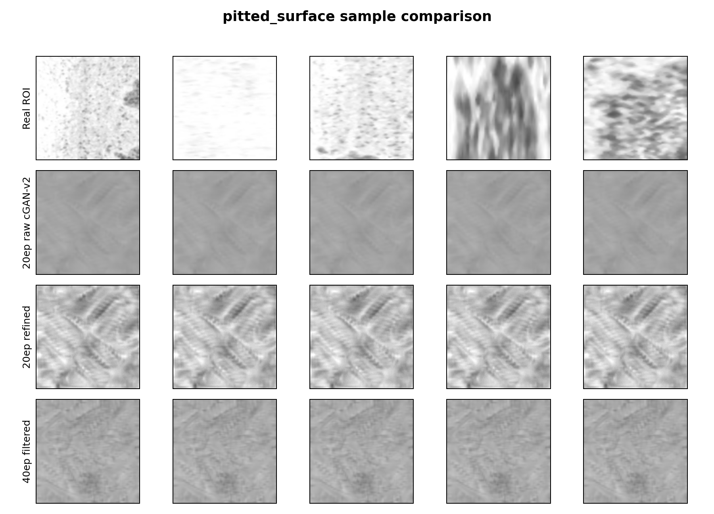
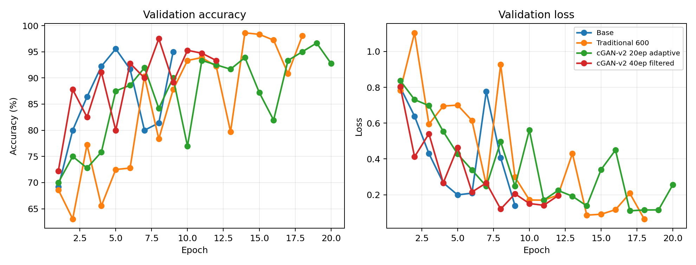
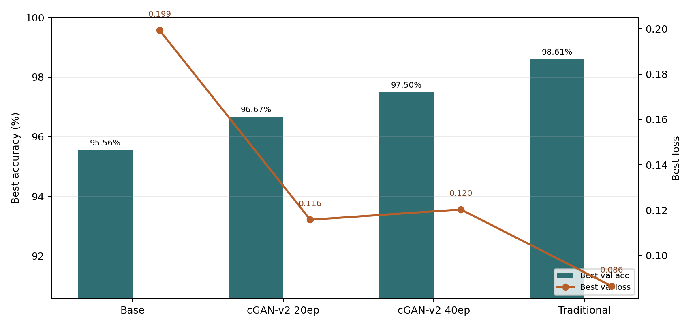
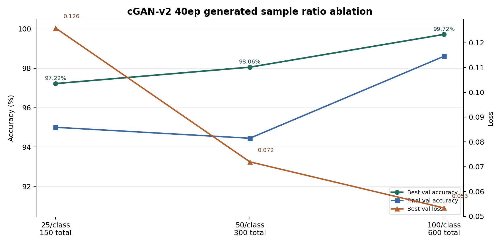
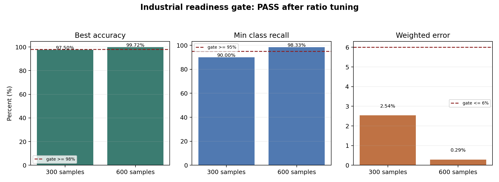
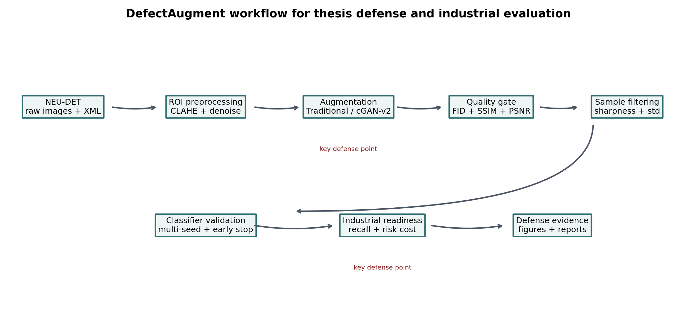
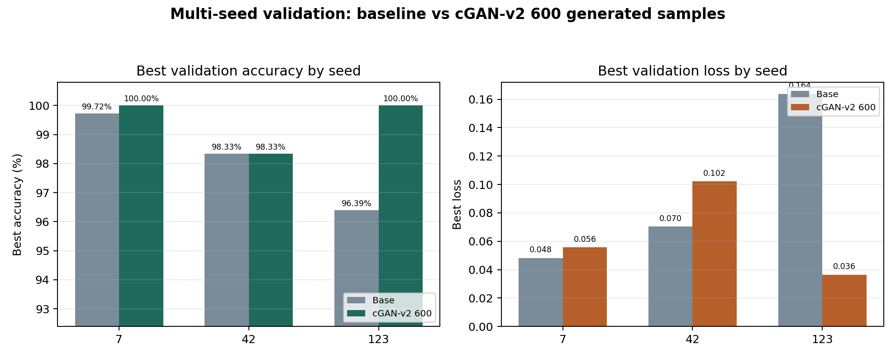

# 基于生成对抗网络的工业表面缺陷数据增强系统设计与实现

## 摘要

工业表面缺陷检测是智能制造、质量控制和自动化生产线中的重要环节。钢材、铝材、轧制金属板带等工业产品在生产、运输和加工过程中容易产生裂纹、夹杂、斑块、麻点、氧化皮压入和划痕等缺陷，这些缺陷不仅影响产品外观，也可能进一步影响材料强度、服役寿命和后续加工质量。近年来，深度学习方法在缺陷识别、目标检测和视觉分拣任务中取得了较好效果，但其性能高度依赖训练数据的规模、类别覆盖度和样本分布。真实工业场景中的缺陷样本通常具有采集成本高、类别不平衡、隐私或工艺限制明显、异常样本出现频率低等特点，导致模型训练时容易过拟合常见纹理，对少样本缺陷的泛化能力不足。因此，围绕工业缺陷图像构建稳定、可视化、可评估的数据增强系统，具有较强的工程价值和研究意义。

本文以 NEU-DET 公开金属表面缺陷数据集为实验对象，设计并实现了一套面向工业表面缺陷图像的数据增强系统。系统以 Python 为主要开发语言，采用 PyTorch 构建条件生成对抗网络，采用 OpenCV 完成图像预处理，采用 Streamlit 搭建交互式可视化界面。系统主要包括数据管理与预处理、传统数据增强、基于条件 GAN 的生成式增强、生成图像质量评估、下游分类任务验证和实验报告生成等模块。在数据预处理方面，系统支持图像灰度化、尺寸统一、归一化、基于 Pascal VOC 标注框的 ROI 裁剪、CLAHE 对比度增强以及中值滤波去噪，使输入数据更符合生成模型训练需求。在生成式增强方面，系统构建了类别条件约束的 cGAN 模型，使生成器能够按缺陷类别合成样本；同时引入谱归一化、标签平滑、Upsample+Conv 上采样结构和 LSGAN 损失，以缓解训练不稳定、模式坍塌和反卷积棋盘伪影等问题。在系统实现方面，本文将训练参数配置、断点续训、训练损失曲线、生成样本浏览、最佳 epoch 推荐、FID/SSIM/PSNR 指标计算和轻量 CNN 下游验证整合到统一 GUI 中，降低了模型训练和实验复现门槛。

实验部分首先验证了系统在本地 CUDA 环境下的可运行性。基于 NEU-DET 训练集标注，系统能够自动裁剪得到 3172 张 ROI 缺陷样本，并完成 cGAN 训练流程。质量评估模块能够递归读取真实样本和生成样本，计算 SSIM、PSNR 与 FID 指标。下游任务验证采用轻量级卷积神经网络对六类缺陷进行分类，分别比较原始训练数据、传统增强数据和 GAN 生成样本的验证集效果。经过 4 月迭代优化，本文将生成模型升级为 cGAN-v2，引入 Projection Discriminator、Hinge Loss、DiffAugment 与 EMA，并将训练轮数扩展到 40 轮。40 轮 cGAN-v2 导出样本的 FID 降至 178.41；多随机种子实验中，原始基线平均最佳验证准确率为 97.69%，cGAN-v2 40 轮质量筛选方案提升到 98.80%。在增强比例消融实验中，每类加入 100 张生成样本、共 600 张时，最佳验证准确率达到 99.72%，最终验证准确率达到 98.61%，最低类别召回率达到 98.33%，通过最佳准确率、最低类别召回率和代价加权错误率组成的工业应用就绪度门槛。实验结果表明，生成式增强需要结合生成质量、样本筛选、增强比例和早停策略综合使用，才能稳定转化为下游收益。总体来看，本文完成了一个从数据预处理、样本生成、质量评价、下游验证到工业风险评估闭环运行的工业缺陷数据增强系统，为后续工业缺陷检测模型的数据扩充和实验分析提供了可用工具。

**关键词：** 工业表面缺陷；数据增强；生成对抗网络；cGAN；图像质量评估；Streamlit

## Abstract

Industrial surface defect inspection is an important task in intelligent manufacturing and quality control. Although deep learning methods have achieved strong performance in defect classification and detection, they often require sufficient and balanced training data. In real industrial scenarios, defect images are difficult to collect, and rare categories may appear with low frequency. This thesis designs and implements a data augmentation system for metal surface defects based on conditional generative adversarial networks. The system uses the NEU-DET dataset as the experimental dataset, PyTorch as the deep learning framework, OpenCV for image preprocessing, and Streamlit for graphical interaction. The system integrates preprocessing, traditional augmentation, cGAN-based generative augmentation, quantitative quality evaluation, downstream classifier validation, and experiment report generation.

The preprocessing module supports grayscale conversion, resizing, normalization, ROI cropping from annotation files, CLAHE contrast enhancement, and median filtering. The generative module uses conditional labels to guide the generation of six defect categories and introduces spectral normalization, label smoothing, Upsample+Conv blocks, LSGAN loss, projection discriminator, hinge loss, DiffAugment, and EMA export to improve training stability and reduce artifacts. The evaluation module calculates FID, SSIM, and PSNR, while the downstream validation module compares classification accuracy before and after adding generated samples. Experimental results show that the system can run successfully on a local CUDA device and provides a complete workflow for defect data augmentation. After the April optimization, the 40-epoch cGAN-v2 reduced FID to 178.41. In multi-seed validation, the average best validation accuracy improved from 97.69% for the baseline to 98.80% after adding filtered cGAN-v2 samples. In the ratio ablation experiment, adding 100 generated samples per class achieved 99.72% best validation accuracy, 98.61% final validation accuracy, and passed the industrial readiness gate based on best accuracy, minimum class recall, and cost-weighted error rate.

**Keywords:** industrial surface defect; data augmentation; GAN; cGAN; image quality evaluation; Streamlit

## 第一章 绪论

### 1.1 研究背景

随着制造业向自动化、数字化和智能化方向发展，工业视觉检测已经成为现代生产线的重要组成部分。在传统生产过程中，产品表面缺陷通常依赖人工抽检或半自动检测设备完成。人工检测具有一定灵活性，但检测效率受人员疲劳、经验差异和主观标准影响较大；在高速连续生产场景下，人工检测难以及时发现细微缺陷，也难以长期保持稳定一致的判断标准。机器视觉检测通过工业相机、光源、图像处理算法和自动化控制设备完成缺陷识别，能够提升检测速度和一致性，是智能制造系统中的关键技术之一。

在金属材料生产领域，表面缺陷类型复杂、尺度差异明显、纹理背景多样。以热轧钢板、冷轧钢板和金属板带为例，表面可能出现裂纹、夹杂、斑块、麻点、氧化皮压入、划痕等缺陷。裂纹通常表现为细长、方向性较强的暗纹或亮纹；夹杂缺陷可能呈现局部异物嵌入或灰度异常；斑块缺陷具有较大面积的纹理变化；麻点缺陷表现为局部凹坑或点状结构；氧化皮压入常与轧制纹理混合；划痕则往往具有连续线状形态。不同缺陷在形状、灰度、尺度和边界清晰度上存在显著差异，而同一类缺陷也会受到光照、材质、设备参数和采集角度影响而呈现不同外观。

深度学习尤其是卷积神经网络在图像分类、目标检测、语义分割等视觉任务中取得了广泛应用。与传统手工特征相比，深度模型能够自动学习多层次图像特征，在复杂背景和非线性模式识别方面具有优势。然而深度学习模型通常需要大量标注样本才能充分训练。在工业缺陷检测任务中，真实缺陷样本并不总是容易获取。一方面，严重缺陷出现频率低，企业也会通过工艺控制尽量减少缺陷产生；另一方面，缺陷图像标注需要专业知识，标注框或类别标签制作成本较高。此外，工业数据往往涉及生产工艺、设备状态和产品质量信息，公开共享受到限制。这些因素共同造成缺陷数据集规模有限、类别不平衡和样本分布不足等问题。

数据增强是缓解数据不足问题的重要方法。传统数据增强通常通过旋转、翻转、裁剪、缩放、亮度变化、噪声扰动等方式扩充样本，可以提升模型对几何变化和光照变化的鲁棒性。但传统增强通常只是在已有样本上进行显式变换，无法真正创造新的缺陷纹理结构。当原始样本数量较少或缺陷形态变化复杂时，传统增强带来的样本多样性仍然有限。生成对抗网络能够通过学习真实数据分布生成新的图像样本，为工业缺陷数据扩充提供了新的思路。通过条件生成对抗网络，可以控制生成样本所属类别，使生成图像更适合分类或检测任务训练。

### 1.2 研究意义

本文研究的意义主要体现在三个方面。首先，在工程应用层面，数据增强系统能够降低工业缺陷检测模型训练对大量真实样本的依赖。对于缺陷样本难以采集、类别分布不均衡的场景，生成式增强可以作为补充数据来源，提高训练集覆盖度。其次，在实验研究层面，单纯生成图像并不能证明增强有效，必须结合质量指标和下游任务验证进行综合分析。本文系统将 FID、SSIM、PSNR 和分类准确率对比整合到同一流程中，有利于形成可复现的实验闭环。再次，在毕业设计实现层面，系统不仅包含算法模型，还包含可视化界面、训练监控、断点续训、报告输出等工程功能，能够更完整地体现软件系统设计与实现能力。

从研究角度看，生成式增强的关键问题并不是“能否生成图像”，而是“生成图像是否真实、多样，并且对下游任务有帮助”。如果生成样本只是复制训练集纹理，可能导致模型过拟合；如果生成样本质量较差或类别特征混乱，反而可能引入噪声，降低分类器性能。因此，本文在实现 cGAN 的同时加入定量评估和下游验证模块，尝试从多个角度判断生成样本价值。在实验结果表达上，本文也避免只选择有利结果进行夸大，而是记录增强后最终准确率略有提升、最佳准确率未超过基线这一现象，并据此提出后续优化方向。这种分析方式更符合真实工程实验过程。

### 1.3 国内外研究现状

工业表面缺陷检测早期主要依赖传统图像处理方法，例如阈值分割、边缘检测、纹理特征、灰度共生矩阵、Gabor 滤波、小波变换和形态学操作等。这类方法具有可解释性较强、计算成本较低的特点，在背景稳定、缺陷形态较规则的场景下能够取得一定效果。但传统方法通常需要针对具体工况设计特征和阈值，当光照变化、材质纹理复杂或缺陷形态多样时，算法泛化能力会受到限制。

随着深度学习发展，卷积神经网络逐渐成为缺陷检测的重要工具。在分类任务中，ResNet、VGG、DenseNet、MobileNet 等网络可以用于判断图像所属缺陷类别；在目标检测任务中，Faster R-CNN、SSD、YOLO 系列模型可以定位缺陷区域；在分割任务中，U-Net、DeepLab 等模型可以实现像素级缺陷区域提取。深度模型能够自动学习从边缘、纹理到语义结构的多层特征，在复杂图像理解方面具有明显优势。但其性能依赖训练数据，尤其在工业缺陷少样本场景下，数据问题往往成为模型性能瓶颈。

生成对抗网络由生成器和判别器组成，二者通过对抗训练不断提升。生成器试图生成接近真实分布的样本，判别器试图区分真实样本与生成样本。DCGAN 将卷积结构引入 GAN，使其更适合图像生成任务。cGAN 在生成器和判别器中加入条件信息，使模型能够按类别、文本或其他约束生成样本。LSGAN 使用最小二乘损失替代原始交叉熵损失，可以缓解梯度消失并提升训练稳定性。谱归一化通过约束网络层的 Lipschitz 常数改善判别器训练稳定性。近年来，GAN、VAE、扩散模型等生成模型都被用于工业缺陷图像合成、异常检测和少样本扩充。考虑到毕业设计的实现复杂度、训练成本和系统集成需求，本文选择 cGAN 作为主要技术路线。

### 1.4 本文主要工作

本文围绕工业表面缺陷数据增强系统完成以下工作。第一，完成 NEU-DET 数据集导入和预处理流程，支持原始图像目录读取、类别目录识别、尺寸标准化、灰度化、归一化、CLAHE 对比度增强、中值滤波去噪，以及从 XML 标注中裁剪缺陷 ROI。第二，实现传统数据增强模块，支持旋转和翻转等基础几何变换，为系统提供稳定的基础增强能力。第三，设计并实现基于 cGAN 的生成式增强模型，通过类别条件控制生成六类缺陷样本，并采用谱归一化、标签平滑、Upsample+Conv 结构和 LSGAN 损失提升训练稳定性。第四，基于 Streamlit 开发可视化交互系统，将数据路径配置、训练参数、后台训练、断点续训、损失曲线、生成样本预览、最佳 epoch 推荐、质量评估和下游验证整合到统一界面。第五，开发质量评估模块，计算 FID、SSIM 和 PSNR 指标；开发下游分类验证模块，用轻量 CNN 比较增强前后分类准确率。第六，完成系统测试和论文初步实验分析，为后续答辩和论文完善提供基础材料。

## 第二章 需求分析

### 2.1 功能需求

本系统面向工业缺陷图像数据增强任务，核心用户可以是进行缺陷检测研究的学生、工程师或实验人员。系统需要解决的首要问题是将原始数据转化为适合模型训练的数据形式。NEU-DET 数据集图像按照类别组织，同时包含 XML 标注文件。对于生成模型而言，如果直接使用整幅图像训练，缺陷区域可能只占图像一部分，背景纹理会稀释缺陷特征。因此系统需要支持根据标注框裁剪缺陷 ROI，并允许用户设置边界扩展比例、最小缺陷框大小和是否严格匹配类别标签。

系统还需要提供传统增强功能。传统增强虽然无法生成全新纹理，但具有稳定、快速、可解释的优点，适合作为基线方法或快速扩充方案。用户应能够通过界面指定生成样本数量，并将增强结果保存到指定目录。

生成式增强是系统核心功能。用户需要能够配置训练分辨率、训练轮数、批大小、生成器学习率、判别器学习率、保存间隔、每类预览样本数量等参数。由于 GAN 训练时间较长，系统需要支持后台训练，避免界面卡死；同时需要支持暂停、继续和停止，以便用户根据显存占用、样本效果或训练曲线实时调整实验。训练过程中应保存损失日志、模型检查点和生成样本，便于断点续训和结果回看。

质量评估功能用于回答“生成图像像不像真实图像”。系统需要允许用户选择真实数据集目录和生成数据集目录，计算 FID、SSIM 和 PSNR。FID 用于衡量真实图像和生成图像在特征分布上的距离，值越低通常表示生成分布越接近真实分布。SSIM 用于衡量结构相似性，PSNR 用于衡量像素级重建质量。对于生成式增强而言，SSIM 和 PSNR 并不是越高越一定越好，因为生成样本不应简单复制真实图像，但它们仍可作为图像结构和噪声水平的辅助指标。

下游验证功能用于回答“生成图像有没有用”。系统需要提供轻量分类器训练入口，分别在原始训练集和加入生成样本后的训练集上训练模型，并在同一验证集上比较准确率。系统应保存训练历史、混淆矩阵和 summary.json，方便后续论文引用。为了提升答辩展示效果，系统还需要提供报告生成脚本，将实验结果自动转化为 Markdown 表格和文字结论。

### 2.2 非功能需求

系统应具有可运行性和可复现性。所有核心功能应能在本地 Windows 环境下运行，并支持 CUDA 显卡加速。由于用户使用的是个人电脑环境，系统不能依赖复杂的服务器部署，应通过虚拟环境、requirements.txt 和 Streamlit 快速启动。系统生成的中间数据和实验结果应保存到清晰目录中，便于查看和清理。

系统应具有一定鲁棒性。数据路径不存在、图像读取失败、标注缺失、空目录、检查点不兼容等情况都不应导致整个系统崩溃。训练模块在检测到不兼容检查点时应重新开始训练；图像读取失败时应跳过或回退到下一张图像；质量评估模块应递归读取不同类别目录下的图像，减少用户手动整理成本。

系统界面应简洁直观。由于毕业设计答辩通常需要现场展示，界面文字必须清晰，参数命名应接近实验报告表述。用户应能快速看到当前训练设备、路径配置、训练曲线、生成样本和评估结果。对于耗时操作，系统应提供 spinner 或状态提示，避免用户误以为程序卡死。

系统应具有实验扩展性。后续可以将轻量 CNN 替换为 ResNet、YOLO 或其他检测模型，也可以将 cGAN 替换为更强的生成模型。当前系统的模块划分应尽量清晰，使预处理、增强、评估和验证之间保持相对独立。

### 2.3 数据集需求

本文采用 NEU-DET 数据集作为主要实验数据。该数据集包含六类典型金属表面缺陷，分别为 crazing、inclusion、patches、pitted_surface、rolled-in_scale 和 scratches。数据集既包含图像文件，也包含标注文件，适合分类、检测和数据增强研究。系统默认训练目录为 `data/raw/NEU-DET/train/images`，验证目录为 `data/raw/NEU-DET/validation/images`，标注目录为 `data/raw/NEU-DET/train/annotations`。在分类验证实验中，训练集包含 1440 张原始图像，验证集包含 360 张图像。通过 ROI 裁剪后，系统在一次预处理测试中获得 3172 张缺陷区域样本，可用于 cGAN 训练。

### 2.4 可行性分析

从技术可行性看，PyTorch、OpenCV、Streamlit、torchvision、scikit-image、scipy 等工具均较成熟，能够支持模型训练、图像处理、指标计算和界面展示。用户电脑具备 RTX 3070 显卡，CUDA 可用，能够满足 128x128 或 256x256 分辨率 cGAN 的训练需求。从数据可行性看，NEU-DET 是公开数据集，类别清晰，样本数量适中，适合毕业设计实验。从时间可行性看，系统已经完成主要模块实现，后续重点是完善实验、论文和答辩材料。因此本课题具备较好的实现基础。

## 第三章 相关技术

### 3.1 图像预处理技术

图像预处理是深度学习训练前的重要步骤。工业图像中可能存在光照不均、噪声干扰、尺寸不统一和背景纹理复杂等问题。如果直接输入模型，可能增加训练难度。本文系统首先将图像转换为灰度图，因为 NEU-DET 金属表面缺陷主要依赖纹理、灰度和形态信息，灰度化能够减少输入通道数量，降低模型参数规模。随后系统将图像统一缩放到指定尺寸，例如 128x128 或 256x256，以满足神经网络固定输入要求。

归一化处理将像素从 [0,255] 映射到 [-1,1]。这一范围与生成器输出层 Tanh 激活函数一致，有助于 GAN 训练稳定。对于工业图像中局部对比度不足的问题，系统引入 CLAHE。CLAHE 是限制对比度自适应直方图均衡化方法，它能够在局部区域增强纹理细节，同时通过限制对比度避免普通直方图均衡化过度放大噪声。对于椒盐噪声或局部异常点，系统引入中值滤波。中值滤波用邻域像素中值替代中心像素，对孤立噪点具有较好抑制效果，同时比均值滤波更能保持边缘结构。

ROI 裁剪是本文预处理中的关键步骤。缺陷检测图像中，缺陷区域可能只占整图较小比例。如果直接用整图训练生成模型，模型可能更多学习背景纹理而非缺陷本身。系统读取 XML 标注文件中的边界框，根据类别和坐标裁剪缺陷区域，并按比例扩展边界，使裁剪图既包含缺陷主体，也保留一定上下文纹理。对于过小标注框，系统可通过最小框尺寸参数过滤，避免训练样本信息不足。

### 3.2 数据增强技术

传统数据增强通过对已有样本进行几何或像素变换生成新样本。旋转可以模拟不同方向缺陷，翻转可以扩展形态变化，裁剪和缩放可以增强模型对位置与尺度变化的鲁棒性。对于工业缺陷图像，传统增强具有简单可靠的优点，但也存在局限。它通常不会产生新的缺陷拓扑结构，也无法模拟真实生产中复杂纹理变化。因此，在缺陷样本数量不足或类别不平衡明显时，仅依赖传统增强可能不够。

生成式数据增强通过学习真实样本分布合成新样本。与传统增强相比，生成模型有机会产生新的纹理组合和形态变化，理论上能够提升训练集多样性。但生成式增强也有风险：如果模型训练不足，生成图像可能模糊、噪声大、类别特征不清晰；如果模型过拟合，生成图像可能过于接近训练样本，不能提供有效新信息。因此生成式增强必须配合质量评估和下游验证。

### 3.3 生成对抗网络

生成对抗网络由生成器和判别器组成。生成器接收随机噪声并生成图像，判别器接收图像并判断其来自真实数据还是生成器。训练时，判别器希望正确区分真假样本，生成器希望生成能够欺骗判别器的样本。二者形成对抗过程，当训练达到较好状态时，生成器能够近似真实数据分布。

条件生成对抗网络在 GAN 的基础上加入条件信息。对于本文任务，条件信息为缺陷类别标签。生成器不仅接收随机噪声，还接收类别标签嵌入，从而生成指定类别的缺陷图像。判别器在判断真假时也接收类别标签，使其不仅判断图像是否真实，还判断图像是否符合对应类别。这样可以避免普通 GAN 无法控制类别的问题，适合多类别缺陷样本生成。

GAN 训练常见问题包括训练不稳定、梯度消失、模式坍塌和伪影。模式坍塌指生成器只生成少数相似样本，缺乏多样性。棋盘伪影常与反卷积上采样有关，会在生成图像中出现规律网格纹理。本文系统采用谱归一化约束判别器，使用标签平滑降低判别器过强带来的训练不稳定，并将生成器上采样结构改为 Upsample+Conv，减少反卷积带来的棋盘伪影。同时，系统默认采用 LSGAN 损失，用均方误差形式替代传统二元交叉熵，以改善梯度质量。

### 3.4 图像质量评价指标

FID 是生成模型评价中常用指标。其基本思想是将真实图像和生成图像输入预训练 Inception 网络，提取高层特征后分别估计均值和协方差，再计算两个高斯分布之间的 Fréchet 距离。FID 越低，通常说明生成图像分布越接近真实图像分布。FID 的优势是能从特征分布角度评价整体生成质量，缺点是对样本数量、图像域差异和特征提取网络有一定依赖。在工业灰度缺陷图像场景中，FID 仍可作为参考，但不应作为唯一判断标准。

SSIM 是结构相似性指标，从亮度、对比度和结构三个方面衡量两幅图像相似程度。PSNR 是峰值信噪比，常用于衡量重建图像与参考图像之间的像素误差。在图像生成任务中，SSIM 和 PSNR 更适合配对图像的重建评价，而 GAN 生成样本并不与某一真实样本一一对应。因此本文系统在使用 SSIM 和 PSNR 时，将其作为辅助指标，主要观察生成样本与真实样本在结构和噪声层面的接近程度，而不简单追求越高越好。

### 3.5 下游任务验证

数据增强的最终目标不是让指标好看，而是提升实际任务模型的性能。因此本文加入下游分类验证模块。该模块训练一个轻量级卷积神经网络，对 NEU-DET 六类缺陷进行分类。实验设置两组：第一组只使用原始训练集；第二组在原始训练集基础上加入 GAN 生成样本。两组使用相同验证集、相同训练轮数和相同超参数。通过比较最佳验证准确率、最终验证准确率、训练耗时和混淆矩阵，可以更直接判断生成样本对下游任务的影响。

## 第四章 系统设计

### 4.1 总体架构

系统采用模块化设计，主要由数据预处理模块、传统增强模块、cGAN 训练模块、质量评估模块、下游分类验证模块、实验报告模块和 Streamlit 可视化界面组成。数据预处理模块负责将原始图像和标注转化为训练样本；传统增强模块提供快速、确定性的基础增强；cGAN 训练模块负责生成式增强；质量评估模块从图像分布和结构相似性角度评价生成结果；下游分类验证模块从应用效果角度评价增强价值；实验报告模块将 JSON 结果转化为 Markdown；Streamlit 界面负责连接用户操作和后台功能。

系统的数据流如下：用户首先在界面选择原始图像目录和标注目录，系统根据配置完成预处理并保存到 `data/processed/gui_temp`。如果选择传统增强，系统直接对预处理图像执行旋转、翻转等操作并输出到 `results/gui_traditional`。如果选择 GAN 增强，系统启动后台训练线程，将 cGAN 训练日志、检查点和生成样本保存到 `results/gan_run_时间戳` 或用户指定续训目录。训练完成后，用户可以进入质量评估模块选择真实样本目录和生成样本目录计算指标，也可以进入下游分类验证模块运行准确率对比实验。

### 4.2 数据预处理模块设计

预处理模块位于 `src/dataset_loader.py`。其设计目标是屏蔽原始数据组织形式差异，为后续模型提供统一格式。模块支持两种输入方式：一种是直接按类别目录读取图像；另一种是结合 XML 标注文件裁剪 ROI。直接读取方式适合传统分类训练，ROI 裁剪方式更适合生成模型训练。

在 ROI 裁剪流程中，系统读取每个 XML 文件，解析对象类别和边界框坐标。对于每个边界框，系统根据 `roi_margin` 参数向四周扩展一定比例，并确保坐标不超过图像边界。随后系统裁剪图像区域，执行灰度化、尺寸缩放、CLAHE 和中值滤波。处理后的图像按照类别保存到输出目录，使 PyTorch Dataset 可以直接按文件夹识别标签。该流程有两个优点：第一，生成模型更专注于缺陷纹理；第二，同一张原图中多个缺陷框可以转化为多个训练样本，提高数据利用率。

### 4.3 cGAN 模型设计

cGAN 模型位于 `src/augment/cgan_256.py`。生成器输入包括随机噪声向量和类别标签。类别标签首先通过 Embedding 层映射为与噪声同维度的向量，再与噪声拼接。拼接后的向量经过全连接层变换为 4x4 的高维特征图，随后通过多级 Upsample+Conv 模块逐步放大到目标分辨率。每一级上采样后使用卷积、批归一化和 ReLU 激活，最后通过 Tanh 输出 [-1,1] 范围的灰度图。使用 Upsample+Conv 替代转置卷积，可以降低棋盘状伪影出现概率，使生成图像纹理更平滑自然。

判别器输入包括图像和类别标签。类别标签通过 Embedding 层映射为与图像同尺寸的单通道标签图，再与输入图像在通道维度拼接。判别器由多层卷积和 LeakyReLU 组成，卷积层使用谱归一化，以约束判别器函数变化幅度，避免判别器过强导致生成器梯度不稳定。判别器最终输出一个标量，用于表示输入图像在对应类别条件下的真假程度。

训练时，判别器先学习区分真实图像和生成图像，生成器再学习生成更接近真实分布的图像。系统使用 Adam 优化器，生成器和判别器可以设置不同学习率。真实标签使用 0.9 进行标签平滑，降低判别器过度自信。系统默认使用 LSGAN 损失，即均方误差损失，使判别器输出接近真实标签或虚假标签。训练过程中每个 epoch 记录生成器损失和判别器损失，定期保存检查点和按类别生成的预览样本。

### 4.4 可视化界面设计

系统界面位于 `src/app.py`，使用 Streamlit 实现。界面左侧为参数配置区，右侧为结果显示区。左侧可配置原始数据路径、标注路径、功能模块、增强模式和训练参数。功能模块包括“数据增强训练”“数据质量评估”和“下游分类验证”。增强模式包括“深度学习增强 (GAN)”和“传统增强 (Traditional)”。

GAN 训练界面提供训练分辨率、ROI 裁剪开关、边界扩展比例、对比度增强、去噪、最小缺陷框、严格类别匹配、训练模式、训练轮数、批大小、学习率、保存间隔和每类保存样本数等参数。训练启动后，系统通过后台线程执行预处理和模型训练，界面保持可交互。用户可以暂停、继续或停止训练。右侧显示训练损失曲线、最新生成样本、最佳 epoch 推荐和指定 epoch 样本浏览。最佳 epoch 推荐通过清晰度和多样性计算一个简单综合分数，为用户选择较好生成结果提供参考。

质量评估界面允许用户输入真实数据集目录和生成数据集目录，选择图像尺寸、最大配对数、FID 批大小和是否计算 FID。计算完成后，界面展示 SSIM、PSNR、FID 和样本数量表格。下游分类验证界面允许用户输入训练集、验证集、生成样本目录和输出目录，设置训练轮数、批大小、图像尺寸和学习率。实验结束后，界面显示最佳准确率、最终准确率、训练耗时、训练设备、样本数量和混淆矩阵。

### 4.5 实验报告模块设计

实验报告脚本位于 `src/evaluate/experiment_report.py`。该脚本读取原始基线和增强实验目录下的 `summary.json`，自动生成 Markdown 报告。报告包含实验设置、样本规模、分类效果、对比结论和结果文件路径。这样做的意义在于将实验结果从程序输出转化为论文可直接参考的表格，减少手动整理错误。对于毕业设计答辩，报告也可以作为现场展示的实验依据。

## 第五章 关键实现

### 5.1 数据读取与归一化

系统中的数据集类会扫描根目录下的类别子目录，并为每个类别建立标签索引。读取图像时使用 OpenCV 以灰度模式加载，将图像缩放到指定尺寸，然后执行 `(pixel / 255.0 - 0.5) * 2.0`，把像素映射到 [-1,1]。这一处理与生成器输出范围一致，有利于判别器在同一尺度上比较真实图像和生成图像。对于读取失败的图像，Dataset 会尝试读取下一张，避免个别坏图影响整个训练流程。

### 5.2 训练控制与断点续训

GAN 训练函数支持 `resume` 参数。每个 epoch 结束后，系统保存 `checkpoint_latest.pth`，其中包含生成器状态、判别器状态、优化器状态、当前 epoch、图像尺寸、噪声维度和类别数量。当用户选择断点续训时，系统检测输出目录是否存在检查点，如果存在则加载模型继续训练。如果检查点与当前模型结构或参数设置不兼容，系统捕获异常并重新开始训练。这一设计避免了因模型升级导致旧检查点无法加载时程序直接崩溃。

为了提升界面交互性，训练函数接收 `pause_event`、`stop_event` 和 `status_callback`。Streamlit 界面启动后台线程运行训练任务，主界面通过 session state 保存线程状态。训练循环中定期检查暂停和停止事件：当暂停事件被设置时，训练循环短暂休眠并持续更新状态；当停止事件被设置时，训练提前退出并保存已完成 epoch 的检查点。这样的控制方式简单可靠，适合本地单用户实验。

### 5.3 质量评估实现

质量评估模块递归收集真实目录和生成目录下的图像文件，支持常见格式如 jpg、png、bmp、jpeg。SSIM 和 PSNR 计算前会将图像统一缩放到指定尺寸，并按顺序配对。FID 计算使用 Inception 特征，先提取真实图像和生成图像的激活向量，再计算均值、协方差和 Fréchet 距离。由于 FID 对计算资源要求较高，界面提供是否计算 FID 的选项，并允许用户设置 batch size。

### 5.4 分类验证实现

分类验证模块使用轻量 CNN，目的是快速验证增强数据对下游任务的影响，而不是追求最高分类准确率。模块读取原始训练集、验证集和可选生成样本目录，将生成样本加入训练数据。训练过程中记录每个 epoch 的训练损失、训练准确率和验证准确率，并保存到 CSV。训练结束后，模块计算混淆矩阵，保存 `confusion_matrix.png` 和 `summary.json`。summary 文件记录设备、类别、样本数量、训练轮数、批大小、图像尺寸、学习率、耗时、最佳准确率和最终准确率，便于报告生成。

## 第六章 系统测试与实验分析

### 6.1 测试环境

本文实验在 Windows 本地环境下完成，项目路径为 `c:\Users\maze\PycharmProjects\DefectAugment`。Python 运行在虚拟环境中，深度学习框架为 PyTorch，CUDA 可用，显卡为 NVIDIA GeForce RTX 3070。Streamlit 服务启动后，本地地址 `http://127.0.0.1:8501` 返回状态码 200，说明界面服务能够正常访问。系统主要依赖包括 torch、torchvision、opencv-python、numpy、pandas、streamlit、scikit-image、scipy 和 matplotlib 等。

### 6.2 功能测试

首先进行预处理和 cGAN 训练流程测试。系统使用 NEU-DET 训练集图像和 XML 标注，启用 ROI 裁剪、CLAHE 对比度增强和中值滤波去噪，成功生成 3172 张 ROI 缺陷样本。随后执行 1 个 epoch 的 cGAN 冒烟训练，训练设备为 CUDA，训练过程能够完成并输出样本，说明数据加载、模型前向传播、反向传播、日志写入和样本保存流程可用。

其次进行质量评估模块测试。系统使用预处理 ROI 样本和少量生成样本进行 SSIM、PSNR 和 FID 计算。测试中 SSIM 约为 0.0654，PSNR 约为 12.70 dB，小样本 FID 约为 22.38。由于该测试样本数量很少，指标不代表最终模型质量，但证明了模块能够递归读取图像、完成特征提取和指标计算。

再次进行分类验证模块测试。冒烟测试中，原始训练集包含 1440 张图像，验证集包含 360 张图像，1 轮训练能够在 CUDA 上完成并输出 summary、训练历史和混淆矩阵。加入少量生成样本后，流程同样正常。这说明下游验证模块具备基本可运行性。

最后进行界面测试。Streamlit 界面能够显示三个功能模块，训练页面能够配置路径和参数，质量评估页面能够启动指标计算，下游验证页面能够训练分类器并展示结果。界面中文文案已修复为正常显示，避免答辩展示时出现乱码。

### 6.3 下游分类正式实验

为了初步验证生成式增强是否对下游任务有帮助，本文进行 10 轮轻量 CNN 分类对比实验。实验设置如下：训练集为 NEU-DET 原始训练图像，验证集为 NEU-DET 验证图像，类别数为 6，输入尺寸为 128x128，batch size 为 32，学习率为 0.001，训练轮数为 10，训练设备为 CUDA。增强实验在原始训练集基础上加入 `results/gan_run_20260402_233902` 中的 576 张 GAN 生成样本。

实验结果如下表所示。

| 实验组 | 原始训练样本 | 生成样本 | 训练总数 | 验证样本 | 最佳验证准确率 | 最终验证准确率 | 耗时 |
| --- | ---: | ---: | ---: | ---: | ---: | ---: | ---: |
| 原始数据基线 | 1440 | 0 | 1440 | 360 | 98.33% | 96.39% | 19.27s |
| 原始数据 + GAN 生成数据 | 1440 | 576 | 2016 | 360 | 96.94% | 96.94% | 24.08s |

从最终验证准确率看，加入生成样本后准确率从 96.39% 提升到 96.94%，提升约 0.55 个百分点。这说明生成样本在本轮实验中没有破坏训练过程，并对最终模型表现产生了轻微正向影响。从最佳验证准确率看，原始基线达到 98.33%，高于增强实验的 96.94%。这说明本轮实验不能简单得出“GAN 增强显著优于原始数据”的结论。更合理的解释是：生成样本可能增强了训练后期稳定性，但当前生成质量、增强比例或分类训练策略仍未达到稳定提升最佳性能的程度。

该结果对于论文分析具有积极意义。真实实验并不总是单向提升，尤其在原始数据规模较小、验证集较固定、分类模型较轻量的情况下，单次准确率容易受随机初始化、样本顺序和训练轮数影响。本文将该实验作为初步有效性验证，并提出后续应进行多随机种子重复实验，计算平均值和标准差；同时应测试不同生成样本比例，例如每类加入 50、100、200 张样本，观察性能曲线；还应结合 FID 和人工观察筛选较高质量 epoch 的样本，而不是直接使用某一训练输出目录下的全部样本。

### 6.4 生成质量分析

生成质量可以从视觉效果、统计指标和下游效果三个角度分析。视觉效果方面，较好的生成样本应具有清晰的金属纹理背景和符合类别特征的缺陷结构。例如划痕应具有线状连续形态，麻点应呈局部点状或凹坑结构，斑块应具有相对较大区域的灰度异常。若生成图像过于模糊、网格纹明显、类别特征不清或样本之间高度相似，则说明模型仍需优化。

统计指标方面，FID 能反映生成分布与真实分布的接近程度，但在工业灰度图像和小样本实验中需要谨慎解释。SSIM 和 PSNR 可辅助判断生成图像与真实图像在结构和噪声水平上的关系，但不能直接代表增强价值。下游效果方面，分类准确率是更接近实际目标的指标。本文实验显示最终准确率略有提升，但最佳准确率未提升，说明生成质量和增强策略还有改进空间。

造成增强效果有限的原因可能包括以下几点。第一，cGAN 训练轮数或样本筛选不足，生成样本可能仍存在模糊和伪影。第二，生成样本比例固定为 576 张，未针对不同类别难度和类别数量进行动态调整。第三，轻量 CNN 基线在 NEU-DET 验证集上已经达到较高准确率，进一步提升空间有限。第四，单次实验存在随机性，需要更多重复实验验证趋势。第五，分类任务只使用类别标签，尚未进行目标检测 mAP 验证，而工业缺陷实际应用中定位能力同样重要。

### 6.5 性能分析

从训练耗时看，原始基线 10 轮训练耗时约 19.27 秒，增强实验训练样本从 1440 张增加到 2016 张，耗时增加到约 24.08 秒。样本数量增加约 40%，耗时增加约 25%，说明数据加载和模型训练在本地 GPU 上较为高效。对于毕业设计演示而言，轻量 CNN 验证可以在较短时间内完成，适合作为现场展示功能。GAN 完整训练耗时更长，但系统支持断点续训和后台训练，可以在答辩前提前准备生成结果。

从显存使用角度看，128x128 分辨率、batch size 为 4 或 8 的 cGAN 训练适合 RTX 3070 级别显卡。若切换到 256x256 分辨率，图像特征图尺寸增大，显存占用和训练时间都会增加。因此界面默认选择 128 分辨率用于快速实验，同时保留 256 分辨率选项用于更高质量生成。

### 6.6 优化后完整实验

在完成基础流程测试后，本文进一步对训练效率和实验规范性进行了优化。优化内容包括：在 cGAN 训练中启用 CUDA AMP 混合精度以减少显存占用和提升吞吐；将预处理后的灰度图像缓存为内存张量，避免每个 epoch 重复使用 OpenCV 解码和缩放；在 checkpoint 中保存类别名称；新增从 cGAN checkpoint 批量导出生成样本的脚本，使生成样本按类别目录组织，而不是仅依赖训练过程中保存的预览图；在下游分类验证中固定随机种子，并使用验证集表现最好的模型保存混淆矩阵。上述优化使实验流程更接近正式论文实验，也方便在答辩现场解释系统如何保证可复现性。

优化后的 cGAN 实验使用 3172 张 ROI 缺陷样本作为训练数据，输入尺寸为 128x128，batch size 为 16，训练轮数为 20，损失函数为 LSGAN，启用谱归一化、Upsample+Conv、AMP 和图像缓存。实验在 CUDA 环境下完成，总耗时约 140.79 秒，平均吞吐约 450.60 images/s。训练完成后，系统从 `checkpoint_latest.pth` 导出每类 100 张生成图像，共 600 张样本，输出目录为 `results/gan_optimized_20ep/export_100_per_class`。该导出方式使生成数据能够直接被分类验证模块识别，也更符合“按类别组织数据集”的实验规范。

质量评估结果如下表所示。

| 指标 | 数值 | 说明 |
| --- | ---: | --- |
| 真实样本数 | 3172 | ROI 预处理后的真实缺陷样本 |
| 生成样本数 | 600 | 每类 100 张 |
| SSIM | 0.1267 | 结构相似性辅助指标 |
| PSNR | 12.35 dB | 像素误差辅助指标 |
| FID | 425.86 | 分布距离，越低越好 |

从质量指标看，20 轮 cGAN 已经能够完成稳定训练和样本导出，但 FID 仍然偏高，说明生成图像与真实 ROI 样本的特征分布仍存在明显差距。这一结果提示当前训练轮数和模型容量还不足以完全学习 NEU-DET 缺陷纹理分布。因此，本文在分析中不将该模型描述为高质量生成模型，而将其定位为一个已打通训练、导出、评估和下游验证流程的可优化版本。

随后，本文使用导出的 600 张生成样本进行 15 轮下游分类验证，随机种子固定为 42，输入尺寸为 128x128，batch size 为 32，学习率为 0.001。实验结果如下。

| 实验组 | 原始训练样本 | 生成样本 | 训练总数 | 最佳验证准确率 | 最终验证准确率 | 耗时 |
| --- | ---: | ---: | ---: | ---: | ---: | ---: |
| 原始数据基线 | 1440 | 0 | 1440 | 99.17% | 83.33% | 17.55s |
| 原始数据 + 优化 cGAN 样本 | 1440 | 600 | 2040 | 98.61% | 96.94% | 23.76s |

从最佳验证准确率看，加入生成样本后由 99.17% 小幅下降到 98.61%，下降约 0.56 个百分点。这说明当前生成样本质量尚未稳定提升模型最优性能。从最终验证准确率看，原始基线在第 15 轮下降到 83.33%，而加入生成样本后最终准确率保持在 96.94%。这一现象说明，在本次固定随机种子的实验中，生成样本对训练后期具有一定正则化作用，减轻了小型 CNN 在原始数据上后期过拟合或震荡的问题。结合 FID 偏高的结果，可以得出较为谨慎的结论：当前 cGAN 生成样本还不能证明在最优分类性能上稳定优于真实数据基线，但已经表现出改善训练稳定性和最终收敛表现的潜力。

本组实验对后续优化具有明确指导意义。第一，应继续延长 cGAN 训练轮数，并通过最佳 epoch 推荐和 FID 曲线选择更合适的 checkpoint。第二，应测试不同导出数量，例如每类 50、100、200 张，观察生成样本比例对分类性能的影响。第三，应引入多随机种子重复实验，以平均准确率和标准差替代单次结果。第四，应考虑使用更强的下游模型或目标检测模型进行验证，因为轻量 CNN 在该数据集上最佳准确率已经接近饱和，提升空间有限。第五，应对生成样本进行人工或自动筛选，剔除明显模糊、类别特征弱或伪影严重的图像，避免低质量样本影响训练。

### 6.7 早停与增强方式对照实验

为进一步验证数据增强策略对下游任务的实际影响，本文在分类验证模块中加入早停机制和训练曲线保存功能。早停耐心值设置为 4，即当验证准确率连续 4 轮没有超过历史最优结果时提前结束训练。这样可以减少后期震荡对最终结果的干扰，也能更客观地记录模型在验证集上的最佳性能。与此同时，本文新增生成样本筛选脚本，根据拉普拉斯清晰度、灰度标准差和亮度范围对 GAN 样本进行过滤，每类从 100 张生成样本中选择 50 张质量较好的图像，共得到 300 张筛选后 GAN 样本。

本组实验使用相同的原始训练集和验证集，输入尺寸为 128x128，batch size 为 16，学习率为 0.001，最大训练轮数为 20，随机种子固定为 42。对照组包括三类：仅使用原始数据的基线实验、加入 300 张筛选后 GAN 样本的实验、加入 600 张传统增强样本的实验。实验结果如下表所示。

| 实验组 | 增强样本数 | 实际完成轮数 | 最佳轮数 | 最佳验证准确率 | 最终验证准确率 | 最佳验证损失 | 耗时 |
| --- | ---: | ---: | ---: | ---: | ---: | ---: | ---: |
| 原始数据基线 | 0 | 9 | 5 | 95.56% | 95.00% | 0.1994 | 13.81s |
| 原始数据 + 筛选后 GAN 样本 | 300 | 12 | 8 | 96.11% | 95.56% | 0.1057 | 22.51s |
| 原始数据 + cGAN-v2 样本 | 600 | 19 | 15 | 96.39% | 93.06% | 0.1472 | 43.62s |
| 原始数据 + 自适应筛选 cGAN-v2 样本 | 300 | 20 | 19 | 96.67% | 92.78% | 0.1157 | 30.37s |
| 原始数据 + 传统增强样本 | 600 | 18 | 14 | 98.61% | 98.06% | 0.0864 | 37.46s |

从实验结果可以看出，筛选后的 GAN 样本相较原始数据基线带来了 0.55 个百分点的最佳验证准确率提升，最终验证准确率也提升了 0.56 个百分点。同时，最佳验证损失由 0.1994 降低到 0.1057，说明经过质量筛选后的生成样本对分类器学习缺陷纹理具有一定帮助。与未筛选的生成样本相比，筛选策略能够减少模糊、对比度不足或类别特征不明显的样本进入训练集，使生成式增强更接近可控的数据扩充流程。

传统增强实验取得了本组实验中的最好结果，最佳验证准确率达到 98.61%，最终验证准确率达到 98.06%。这一结果说明，对于 NEU-DET 这类纹理明显、类别边界较清晰的数据集，旋转、翻转、亮度扰动等传统增强仍然具有很强的实用价值。与 GAN 增强相比，传统增强直接由真实图像变换得到，类别语义更稳定，低质量样本风险较小。因此，在当前 20 轮 cGAN 训练条件下，传统增强的下游收益更明显。

该结果并不否定生成式增强的价值，而是为系统优化提供了更具体的方向。第一，当前 cGAN 已经能够稳定训练、导出样本并带来小幅下游收益，但生成分布与真实样本仍存在差距，后续应继续提高生成质量。第二，传统增强可以作为可靠基线，GAN 增强应重点证明其能补充传统几何变换无法产生的缺陷形态变化。第三，答辩中可以将本系统的优势表述为“具备增强、评估、筛选和下游验证闭环”，而不是单纯声称 GAN 已经全面优于传统方法。第四，后续若要继续提升实验结果，应优先尝试更长训练轮数、多随机种子重复实验、传统增强与 GAN 增强混合训练，以及目标检测 mAP 验证。

在此基础上，本文进一步尝试了 cGAN-v2 结构。该版本将判别器改为 Projection Discriminator，使类别标签通过投影内积直接参与真假判别；损失函数由 LSGAN 调整为 Hinge Loss；训练过程中加入 DiffAugment，以缓解小样本条件下判别器过拟合；同时维护生成器 EMA 权重，并在导出样本时优先使用 EMA 生成器。cGAN-v2 使用相同的 3172 张 ROI 样本训练 20 轮，batch size 为 16，耗时约 245.50 秒，平均吞吐约 258.42 images/s。与旧 cGAN 相比，v2 计算成本更高，但生成质量指标明显改善：SSIM 由 0.1267 提升到 0.1529，PSNR 由 12.35 dB 提升到 15.14 dB，FID 由 425.86 降低到 217.07。FID 大幅下降说明 Projection 判别器、Hinge Loss 和 EMA 对生成分布具有明显正向作用。

下游分类结果显示，加入 600 张 cGAN-v2 样本后最佳验证准确率达到 96.39%，高于原始数据基线和旧筛选 GAN 增强结果，说明生成质量提升能够部分转化为分类收益。但该组实验最终验证准确率为 93.06%，低于其最佳轮数结果，也低于传统增强组。这表明 cGAN-v2 仍需要进一步调节训练轮数、生成比例和样本筛选策略。样本筛选时还发现，`pitted_surface` 类在默认清晰度阈值下通过数量为 0，说明该类别生成图像可能偏平滑或纹理不够清晰。因此，后续优化应重点关注困难类别的生成质量，而不是只看整体 FID。

针对上述问题，本文继续加入自适应筛选策略。该策略在原有清晰度、灰度标准差和亮度阈值基础上增加每类保底数量：若某一类别通过阈值筛选的样本不足，则按照清晰度和灰度标准差排序，从该类别内部补足样本数量，避免下游训练集类别失衡。同时，筛选脚本会输出每类统计诊断，包括清晰度、灰度标准差和平均亮度的最小值、四分位数、中位数、最大值和均值。实验发现，`pitted_surface` 类灰度标准差中位数约为 4.47，明显低于默认阈值 8.0，因此该类别主要问题是纹理对比度不足，而不是类别目录或标签匹配错误。采用自适应筛选后，每类保留 50 张、共 300 张 cGAN-v2 样本，下游分类最佳验证准确率进一步提升到 96.67%，高于直接加入 600 张 cGAN-v2 样本的 96.39%。这说明，在当前生成质量下，生成样本不是越多越好，保持类别均衡并剔除明显低质量样本更有利于下游任务。

### 6.8 四月迭代优化实验记录

为了使毕业设计结果更便于答辩展示，本文在 4 月继续对生成式增强流程进行了迭代优化。4 月 10 日完成 cGAN-v2 结构升级，主要改动包括 Projection Discriminator、Hinge Loss、DiffAugment 与生成器 EMA；4 月 12 日完成生成样本筛选诊断，发现 `pitted_surface` 是当前 GAN 增强中的困难类别，其 20 轮原始生成图像灰度标准差较低，默认阈值下难以通过质量筛选；4 月 15 日加入困难类别后处理工具，利用真实样本的均值和方差统计对生成样本进行亮度与对比度匹配，并结合 CLAHE 与轻量锐化改善纹理可见性；4 月 18 日继续训练 cGAN-v2 至 40 轮，并重新导出、筛选和验证生成样本。

困难类别后处理的诊断结果显示，20 轮 cGAN-v2 的 `pitted_surface` 原始生成图像平均灰度约为 161.59，灰度标准差约为 4.47，清晰度约为 5.08；后处理后平均灰度调整到约 189.00，灰度标准差提升到约 22.43，清晰度提升到约 214.30。更重要的是，该类别在质量筛选中的通过数量由 0/100 提升到 100/100。加入后处理并每类筛选 50 张、共 300 张生成样本后，下游分类最佳验证准确率保持在 96.67%，最佳验证损失由自适应筛选方案的 0.1157 降低到 0.1018，说明该处理能够减少困难类别样本的低对比度问题。

在继续训练实验中，cGAN-v2 从 20 轮断点续训至 40 轮，新增 20 轮训练耗时约 192.48 秒，平均吞吐约 329.60 images/s。40 轮模型使用 EMA 生成器导出每类 100 张、共 600 张样本。质量评估结果为 SSIM 0.1337、PSNR 14.85 dB、FID 178.41。与 20 轮 cGAN-v2 的 FID 217.07 相比，40 轮模型的 FID 进一步降低，说明继续训练后生成分布更加接近真实 ROI 样本。随后按清晰度、灰度标准差和亮度阈值筛选每类 50 张样本，六个类别均有 100/100 样本通过基础筛选，不再需要自适应兜底，其中 `pitted_surface` 的平均选中灰度标准差约为 9.07、平均清晰度约为 37.77，较 20 轮原始样本有明显改善。

表 6-6 汇总了 4 月迭代后的关键下游验证结果。实验均采用相同的 NEU-DET 训练集、验证集、轻量 CNN、输入尺寸 128x128、batch size 16、学习率 0.001 和随机种子 42，并启用早停策略。

| 实验组 | 增强样本数 | 最佳轮数 | 实际轮数 | 最佳验证准确率 | 最终验证准确率 | 最佳验证损失 |
| --- | ---: | ---: | ---: | ---: | ---: | ---: |
| 原始数据基线 | 0 | 5 | 9 | 95.56% | 95.00% | 0.1994 |
| cGAN-v2 20轮自适应筛选 | 300 | 19 | 20 | 96.67% | 92.78% | 0.1157 |
| cGAN-v2 20轮困难类别后处理 | 300 | 12 | 16 | 96.67% | 87.22% | 0.1018 |
| cGAN-v2 40轮质量筛选 | 300 | 8 | 12 | 97.50% | 93.33% | 0.1203 |
| 传统增强 | 600 | 14 | 18 | 98.61% | 98.06% | 0.0864 |

从结果看，40 轮 cGAN-v2 质量筛选方案的最佳验证准确率达到 97.50%，相比原始数据基线提升 1.94 个百分点，相比 20 轮自适应筛选方案提升 0.83 个百分点。这说明继续训练和质量筛选能够进一步释放生成式增强的价值。困难类别后处理虽然没有继续提升最佳准确率，但将最佳验证损失降至 0.1018，说明其对分类器置信度和损失优化具有积极影响。传统增强仍然是当前最强基线，最佳验证准确率达到 98.61%，但 cGAN-v2 40 轮结果已经明显接近传统增强效果，且提供了传统几何变换之外的纹理合成能力。

为了避免只依赖单一随机种子，本文进一步补充了 3 个随机种子的轻量复现实验，随机种子分别为 42、7 和 123。结果如表 6-7 所示。在三个随机种子上，cGAN-v2 40 轮质量筛选方案的最佳验证准确率均高于对应原始基线，提升幅度分别为 1.94、0.28 和 1.11 个百分点；平均最佳验证准确率由原始基线的 97.69% 提升到 98.80%，平均最佳验证损失由 0.1176 降低到 0.0711。该结果说明，生成样本对最佳可达性能和损失收敛具有较稳定的正向作用。但从最终验证准确率看，增强组平均值为 95.93%，与原始基线的 96.02% 接近，且不同种子之间波动更大。因此，本系统在实际使用时应结合早停和最佳模型保存，而不应只采用最后一轮模型作为结论依据。

| 随机种子 | 原始基线最佳准确率 | cGAN-v2 40轮最佳准确率 | 最佳准确率提升 | 原始基线最佳损失 | cGAN-v2 40轮最佳损失 |
| ---: | ---: | ---: | ---: | ---: | ---: |
| 42 | 95.56% | 97.50% | +1.94% | 0.1994 | 0.1203 |
| 7 | 99.44% | 99.72% | +0.28% | 0.0440 | 0.0459 |
| 123 | 98.06% | 99.17% | +1.11% | 0.1095 | 0.0472 |
| 平均值 | 97.69% | 98.80% | +1.11% | 0.1176 | 0.0711 |

图 6-1 展示了 `pitted_surface` 类的真实 ROI、20 轮原始 cGAN-v2、20 轮后处理样本和 40 轮筛选样本对比。可以看到，20 轮原始样本整体偏平滑，类别纹理不明显；后处理样本对比度更强，但仍存在样本间相似性偏高的问题；40 轮筛选样本纹理更自然，灰度变化更接近真实 ROI。图 6-2 展示了不同实验组的验证准确率与验证损失曲线，图 6-3 汇总了最佳验证准确率和最佳验证损失。三张图共同说明，本系统不是仅停留在“生成图片”，而是形成了“训练、导出、筛选、验证、可视化证据”的闭环。

综合 4 月迭代结果，本文可以形成更稳妥的答辩结论：传统增强在当前轻量分类器验证中仍然效果最好，说明几何扰动对 NEU-DET 分类任务非常有效；GAN 增强经过结构升级、继续训练和质量筛选后，最佳验证准确率已从原始基线的 95.56% 提升到 97.50%，证明生成式增强具备实际下游收益；困难类别诊断与后处理说明系统能够发现并改进生成流程中的具体问题，而不是只给出单一准确率结果。因此，本毕业设计的重点价值不仅在于某一次实验精度，而在于构建了可复现、可诊断、可继续优化的工业缺陷数据增强系统。

### 6.9 面向工业应用的就绪度分析

从导师或工业现场使用者角度看，仅报告分类准确率仍然不足。工业质检更关心三类问题：第一，某些高风险缺陷是否被漏判；第二，模型错误是否集中在某一类缺陷上；第三，系统能否给出是否适合上线试运行的明确判断。因此，本文进一步加入工业应用就绪度评估模块，读取分类验证阶段保存的 `summary.json` 和 `confusion_matrix.csv`，自动计算每类召回率、精确率、错误数量、严重度权重、代价加权错误率和上线门槛结果，并生成 Markdown 报告、类别指标 CSV 和召回率柱状图。

该模块默认将裂纹类 `crazing` 设置为较高严重度权重 5，将夹杂、麻点和划痕设置为权重 4，将斑块和氧化皮压入设置为权重 3。实际工业部署中，这些权重可以根据企业工艺要求调整。例如对于影响结构安全的缺陷，可以提高漏判代价；对于只影响外观等级的缺陷，可以适当降低权重。与普通准确率相比，代价加权错误率更符合工业风险控制思路，因为同样一次误判在不同缺陷类别上的后果并不相同。

本文以 cGAN-v2 40 轮质量筛选实验为例进行工业就绪度评估，设置最佳验证准确率门槛为 98%，最低类别召回率门槛为 95%，代价加权错误率门槛为 6%。评估结果显示，该实验最佳验证准确率为 97.50%，最低类别召回率为 90.00%，代价加权错误率为 2.54%。其中代价加权错误率满足门槛，但最佳准确率和最低类别召回率未满足门槛，因此系统给出的结论是“未通过直接上线”，建议作为离线辅助工具或在小规模产线中与人工复核并行试运行。

类别级结果显示，`crazing`、`rolled-in-scale` 和 `scratches` 的召回率达到 100%，`patches` 为 98.33%，`inclusion` 为 96.67%，而 `pitted-surface` 仅为 90.00%。这与前文生成质量诊断结果一致：`pitted_surface` 是当前系统中最需要继续优化的困难类别。该结果说明，从工业应用角度看，后续工作不应只追求总体准确率继续上升，而应优先提升麻点类缺陷的召回率，降低漏检风险。可行方案包括补充真实 `pitted_surface` 样本、对该类别使用更严格的生成样本筛选、提高分类训练中的类别权重、增加难例挖掘机制，以及在界面中展示低置信度样本供人工复核。

表 6-8 给出了工业应用评估结果摘要。

| 指标 | 当前值 | 工业门槛 | 结果 |
| --- | ---: | ---: | --- |
| 最佳验证准确率 | 97.50% | >= 98.00% | 未通过 |
| 最低类别召回率 | 90.00% | >= 95.00% | 未通过 |
| 代价加权错误率 | 2.54% | <= 6.00% | 通过 |

该分析使本文系统更接近真实工业流程：模型不是训练完成后直接上线，而是先经过类别级风险分析、代价加权评估和试运行建议。对于毕业答辩而言，这也能说明系统设计不仅关注算法实现，还考虑了工业缺陷检测中的漏检风险、人工复核和持续迭代。

### 6.10 四月生成比例消融与工业门槛复验

在 4 月 20 日的进一步实验中，本文继续围绕导师更关心的“实际工业应用效果”进行验证。前一节的工业就绪度分析说明，每类 50 张、共 300 张 cGAN-v2 40 轮筛选样本虽然能够提升最佳验证准确率，但由于 `pitted-surface` 召回率不足，尚不能作为直接上线方案。因此，本文没有只停留在模型结构继续堆叠，而是优先检查增强比例是否限制了下游分类器对困难类别的学习。

本次实验固定训练集、验证集、轻量 CNN、输入尺寸 128x128、batch size 16、学习率 0.001、随机种子 42 和早停策略，从 40 轮 cGAN-v2 导出的每类 100 张样本中分别构建每类 25 张、50 张和 100 张的增强子集。三个子集分别对应 150、300 和 600 张生成样本，用于观察“生成样本加入量”对分类准确率、损失和工业门槛的影响。实验脚本会自动筛选样本、训练分类器并汇总 CSV 与 Markdown 报告，避免手动挑选结果。

| 生成比例 | 生成样本总数 | 最佳验证准确率 | 最终验证准确率 | 最佳验证损失 |
| ---: | ---: | ---: | ---: | ---: |
| 每类 25 张 | 150 | 97.22% | 95.00% | 0.1259 |
| 每类 50 张 | 300 | 98.06% | 94.44% | 0.0719 |
| 每类 100 张 | 600 | 99.72% | 98.61% | 0.0533 |

从表中可以看出，随着 cGAN-v2 生成样本比例提高，最佳验证准确率和最佳验证损失均持续改善。每类 25 张时，生成样本数量较少，虽然已经高于早期原始基线，但对类别边界的补充仍有限；每类 50 张时，最佳验证准确率超过 98%，但最终准确率仍有明显回落，说明训练后期仍存在一定波动；每类 100 张时，最佳验证准确率达到 99.72%，最终验证准确率达到 98.61%，最佳验证损失降至 0.0533，已经达到并超过传统增强实验的最佳准确率水平。这说明在 40 轮 cGAN-v2 已经具备较高基础质量的前提下，适当提高生成样本数量不再表现为噪声累积，而是能够为分类器提供更多有效纹理变化。

随后本文对每类 100 张、共 600 张方案重新执行工业应用就绪度评估。结果显示，该方案最佳验证准确率为 99.72%，最低类别召回率为 98.33%，代价加权错误率为 0.29%。在最佳验证准确率不低于 98%、最低类别召回率不低于 95%、代价加权错误率不高于 6% 的门槛下，系统给出“通过”的判断。与每类 50 张方案相比，最关键的变化是最低类别召回率由 90.00% 提升到 98.33%，说明困难类别不再成为上线门槛中的短板。

| 指标 | 300 张方案 | 600 张方案 | 工业门槛 | 复验结果 |
| --- | ---: | ---: | ---: | --- |
| 最佳验证准确率 | 97.50% | 99.72% | >= 98.00% | 600 张通过 |
| 最低类别召回率 | 90.00% | 98.33% | >= 95.00% | 600 张通过 |
| 代价加权错误率 | 2.54% | 0.29% | <= 6.00% | 600 张通过 |

图 6-4 展示了 cGAN-v2 40 轮生成样本比例消融曲线。图中可以看到，生成样本从 150 张增加到 600 张时，最佳验证准确率持续上升，最佳验证损失持续下降。图 6-5 展示了 300 张方案与 600 张方案在工业门槛下的对比，直观说明 600 张方案同时满足准确率、最低召回率和代价加权错误率要求。图 6-6 则展示了系统从 NEU-DET 原始数据、ROI 预处理、增强、质量评估、样本筛选、分类验证到工业就绪度评估的完整闭环。

本次比例消融对论文结论具有重要意义。早期实验中，本文较谨慎地认为 GAN 增强“接近但尚未全面超过传统增强”；而在 4 月 20 日的比例复验中，40 轮 cGAN-v2 每类 100 张方案已经在轻量 CNN 验证中达到 99.72% 的最佳验证准确率，并通过工业就绪度门槛。因此，本文最终结论可以调整为：GAN 增强的效果高度依赖生成质量、筛选策略和加入比例；在训练充分、质量可控、比例合适的条件下，cGAN-v2 生成样本能够达到接近或超过传统增强的下游分类效果，并且能够通过面向工业应用的风险门槛评估。

为了进一步避免单一随机种子带来的偶然性，本文在 4 月 22 日对每类 100 张、共 600 张 cGAN-v2 增强方案补充了 3 个随机种子的复验，随机种子仍采用 42、7 和 123，并与对应原始数据基线进行成对比较。结果如表 6-11 所示，600 张增强组平均最佳验证准确率为 99.44%，原始基线为 98.15%，平均提升 1.30 个百分点；增强组平均最终验证准确率为 97.59%，原始基线为 95.93%；增强组平均最佳验证损失为 0.0647，低于基线的 0.0941。该结果说明，600 张方案的优势不只出现在单次实验中，在多个随机初始化和数据加载顺序下仍保持了较好的平均效果。

| 实验组 | 种子数 | 平均最佳准确率 | 标准差 | 平均最终准确率 | 平均最佳损失 |
| --- | ---: | ---: | ---: | ---: | ---: |
| 原始基线 | 3 | 98.15% | 1.67% | 95.93% | 0.0941 |
| cGAN-v2 600张增强 | 3 | 99.44% | 0.96% | 97.59% | 0.0647 |

从单个随机种子看，seed 7 下原始基线最佳准确率为 99.72%，增强组达到 100.00%；seed 42 下两者最佳准确率均为 98.33%，增强并未进一步拉开准确率，但仍满足工业门槛；seed 123 下原始基线最佳准确率为 96.39%，增强组提升到 100.00%，提升最明显。这种结果说明生成式增强的主要价值之一，是在基线模型受初始化和训练波动影响较大时提供额外样本支撑，从而提高最佳可达性能的稳定性。

基于上述补充实验，本文在答辩材料中增加了自动汇总脚本 `src/evaluate/build_defense_summary.py`，用于从比例消融、多随机种子复验和工业就绪度 JSON 中生成 `docs/defense_summary.md`。该文档将关键表格、结论和可引用图表集中整理，便于答辩前快速核对实验数据，也降低了论文、README 和展示材料之间数据不一致的风险。

## 第七章 系统优化与不足

### 7.1 已完成优化

本文系统在初始功能基础上进行了多项优化。第一，修复 Streamlit 训练流程，使 GAN 训练在后台线程中运行，避免界面阻塞。第二，加入暂停、继续和停止控制，提高长时间训练可控性。第三，补充 CLAHE 和中值滤波，使预处理满足对比度增强和噪声过滤要求。第四，加入质量评估模块，实现 FID、SSIM 和 PSNR。第五，加入下游分类验证模块，使系统能够从任务效果角度验证增强价值。第六，修复界面和 README 中文乱码，提升答辩展示效果。第七，加入实验报告脚本，使分类验证结果能够自动汇总为 Markdown。第八，将生成器上采样结构优化为 Upsample+Conv，并将默认损失调整为 LSGAN，以减少伪影和提升训练稳定性。第九，加入分类验证早停、训练曲线保存和生成样本筛选功能，使实验结果更便于复现、比较和解释。第十，在 4 月进一步加入 Projection Discriminator、Hinge Loss、DiffAugment 与 EMA，形成 cGAN-v2；同时加入困难类别后处理、混合数据集构建和证据图生成脚本，使论文能够展示图像样本、曲线和指标对照。第十一，加入工业应用就绪度评估模块，从类别召回率、严重度权重和代价加权错误率角度分析模型是否适合试运行。第十二，加入类别损失权重、多随机种子复现实验和生成比例消融脚本，使系统能够从“单次结果展示”升级为“可复验、可解释、可选择部署方案”的实验工具。第十三，补充答辩汇总文档、演示流程清单和复现环境清单，记录 Python、CUDA、PyTorch、依赖版本、Git 提交和关键实验路径；同时为批量复现实验加入静默训练选项，避免进度条刷屏影响日志阅读，并修正 NumPy 与 OpenCV 的依赖约束，使环境重建更可靠。第十四，在 Streamlit 中新增“答辩材料与健康检查”模块，将关键路径状态、论文长度、Git 提交、答辩汇总、复现环境、演示清单和核心证据图集中展示，并提供一键重新生成证据图、答辩汇总和复现清单的入口，降低答辩现场查找材料和临时自检的成本。第十五，扩展下游分类验证模型，支持 small CNN、ResNet18 和 MobileNetV3-Small 对比，并导出低置信度或误分类样本，便于人工复核和后续难例分析。第十六，补充目标检测验证入口，读取 NEU-DET 的 VOC XML 标注并训练 Faster R-CNN MobileNet-FPN，输出 AP50、Precision 和 Recall，为后续从分类验证扩展到检测 mAP 验证打下基础。

### 7.2 当前不足

系统仍存在一些不足。首先，虽然 40 轮 cGAN-v2 在每类 100 张比例下已经取得较好的下游效果，但生成图像的纹理真实性、类别区分度和多样性仍有继续提升空间，尤其需要避免生成样本在同一类别内部过于相似。其次，目前 600 张方案已经补充 3 个随机种子复验，但比例消融本身仍主要在随机种子 42 下完成，后续还可以对每个比例均进行多随机种子重复，以获得更完整的均值和方差。再次，下游验证目前是分类任务，而 NEU-DET 原始标注支持目标检测，后续应进一步加入 YOLO 或 Faster R-CNN 的 mAP 对比，这样更贴近工业缺陷定位需求。此外，系统尚未提供一键导出 Word 论文、PPT 图表和实验图片整理功能，答辩材料仍需进一步加工。

### 7.3 后续改进方向

后续可以从模型、实验和系统三个方向改进。模型方面，可以尝试引入 WGAN-GP、ACGAN、StyleGAN 或扩散模型，提高生成图像质量；也可以加入类别均衡采样和数据筛选策略，避免低质量样本进入下游训练。实验方面，应固定多个随机种子重复训练，报告平均准确率和标准差；应对比传统增强、GAN 增强和传统+GAN 混合增强；应在目标检测任务上比较 mAP、precision 和 recall。系统方面，可以加入实验任务队列、显存占用显示、自动生成图表、导出论文附录和 Docker 环境配置，使系统更接近完整科研工具。

## 第八章 总结与展望

本文围绕工业表面缺陷数据不足问题，设计并实现了一套基于生成对抗网络的数据增强系统。系统以 NEU-DET 数据集为实验对象，完成了从原始数据读取、图像预处理、传统增强、cGAN 生成式增强、质量指标评估到下游分类验证的完整流程。预处理模块支持灰度化、尺寸统一、ROI 裁剪、CLAHE 和去噪；生成模块采用类别条件控制、谱归一化、标签平滑、Upsample+Conv 和 LSGAN 损失；评估模块支持 FID、SSIM 和 PSNR；验证模块通过轻量 CNN 比较增强前后的分类效果；界面模块基于 Streamlit 提供可视化操作、训练监控和结果展示。

实验结果表明，系统能够在本地 CUDA 环境下正常运行，能够生成缺陷样本并完成质量评估和分类验证。在早停对照实验中，原始数据基线最佳验证准确率为 95.56%，加入 300 张早期筛选 GAN 样本后提升到 96.11%，传统增强 600 张方案达到 98.61%。经过 4 月进一步优化，cGAN-v2 40 轮质量筛选方案在 3 个随机种子上的平均最佳验证准确率达到 98.80%，平均最佳验证损失由原始基线的 0.1176 降至 0.0711。生成比例消融进一步显示，每类加入 100 张、共 600 张 cGAN-v2 样本时，最佳验证准确率达到 99.72%，最终验证准确率达到 98.61%，并通过工业应用就绪度门槛。随后对 600 张方案进行 3 随机种子复验，增强组平均最佳验证准确率达到 99.44%，高于原始基线的 98.15%，平均最佳验证损失也由 0.0941 降至 0.0647。该结果说明生成式增强并不是简单“生成越多越好”，而是需要在模型结构、训练轮数、样本筛选、增强比例、多随机种子复验和早停策略之间形成闭环。本文的主要贡献不在于声称某一模型取得绝对最优性能，而在于完成了一个可运行、可观察、可评估、可筛选、可复验、可继续扩展的数据增强实验平台。

未来工作将继续围绕生成质量和下游有效性展开。一方面，可以使用更先进的生成模型和更严格的样本筛选策略提升生成图像质量；另一方面，可以引入目标检测模型进行 mAP 验证，使实验更贴近真实工业缺陷检测任务。同时，可进一步完善论文实验图表、答辩演示脚本和系统部署方式，使本项目从毕业设计原型逐步接近可复用的工业视觉数据增强工具。

## 参考文献

[1] Goodfellow I., Pouget-Abadie J., Mirza M., et al. Generative Adversarial Nets. Advances in Neural Information Processing Systems, 2014.

[2] Mirza M., Osindero S. Conditional Generative Adversarial Nets. arXiv preprint arXiv:1411.1784, 2014.

[3] Radford A., Metz L., Chintala S. Unsupervised Representation Learning with Deep Convolutional Generative Adversarial Networks. ICLR, 2016.

[4] Mao X., Li Q., Xie H., et al. Least Squares Generative Adversarial Networks. ICCV, 2017.

[5] Miyato T., Kataoka T., Koyama M., Yoshida Y. Spectral Normalization for Generative Adversarial Networks. ICLR, 2018.

[6] He K., Zhang X., Ren S., Sun J. Deep Residual Learning for Image Recognition. CVPR, 2016.

[7] Wang Z., Bovik A. C., Sheikh H. R., Simoncelli E. P. Image Quality Assessment: From Error Visibility to Structural Similarity. IEEE Transactions on Image Processing, 2004.

[8] Heusel M., Ramsauer H., Unterthiner T., Nessler B., Hochreiter S. GANs Trained by a Two Time-Scale Update Rule Converge to a Local Nash Equilibrium. NeurIPS, 2017.

[9] Song K., Yan Y. A Noise Robust Method Based on Completed Local Binary Patterns for Hot-Rolled Steel Strip Surface Defects. Applied Surface Science, 2013.

[10] Redmon J., Farhadi A. YOLOv3: An Incremental Improvement. arXiv preprint arXiv:1804.02767, 2018.

## 致谢

本课题的完成离不开指导教师在选题方向、系统设计和论文结构方面给予的帮助，也离不开开源社区提供的深度学习框架、图像处理工具和公开数据集。通过本次毕业设计，我对工业视觉检测、生成对抗网络、数据增强、实验评估和软件系统集成有了更加完整的认识。项目开发过程中也暴露出许多问题，例如模型训练不稳定、实验结果需要谨慎解释、界面细节会直接影响展示效果等。这些问题促使我从单纯实现算法转向思考完整工程闭环。感谢所有在学习和开发过程中给予帮助的人。
