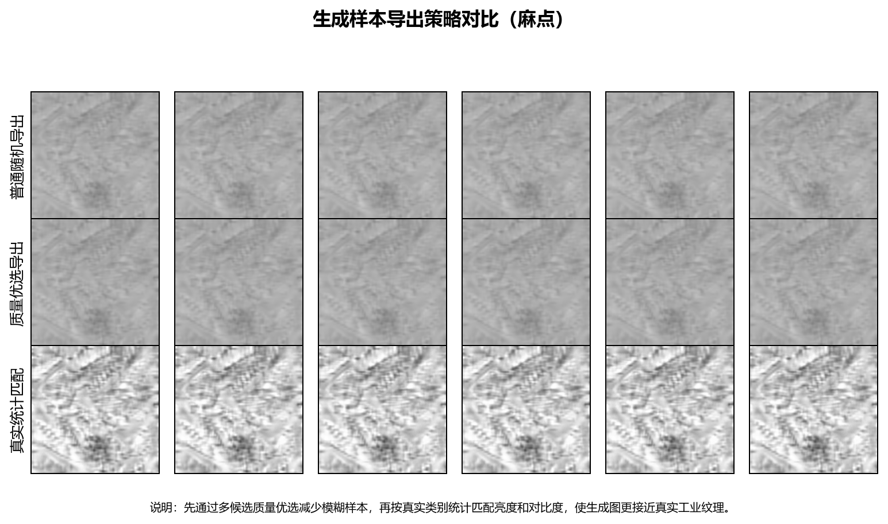

# 基于生成对抗网络的工业表面缺陷数据增强系统设计与实现

## 摘要

金属表面缺陷检测直接关系到产品分级、后续加工和使用安全。板材在轧制、运输和加工过程中可能出现裂纹、夹杂、斑块、麻点、氧化皮压入和划痕等缺陷，若只依赖人工目检，不仅效率有限，也容易受到疲劳和主观经验影响。近年来，卷积神经网络、目标检测模型和生成模型逐渐用于工业视觉场景，但这类方法有一个绕不开的前提：训练数据要足够、类别分布要相对均衡。现实生产中恰好相反，缺陷样本采集成本高，少见缺陷出现频率低，标注还需要专业人员参与，数据不足便成为模型落地前必须处理的问题。

围绕上述问题，本课题以 NEU-DET 金属表面缺陷数据集为对象，开发了一套面向工业缺陷图像的数据增强系统。系统基于 Python、PyTorch、OpenCV 和 Streamlit 实现，功能覆盖数据预处理、传统增强、条件生成对抗网络增强、图像质量评价、样本筛选、下游分类验证、工业应用就绪度评估以及答辩材料健康检查。预处理阶段完成灰度化、尺寸统一、ROI 裁剪、CLAHE 对比度增强和中值滤波去噪；生成阶段以 cGAN 为基础，逐步引入 Upsample+Conv、LSGAN、谱归一化、Projection Discriminator、Hinge Loss、DiffAugment 和 EMA；评估阶段则把 FID、SSIM、PSNR 与下游分类结果结合起来，避免只凭肉眼观感判断生成样本质量。

实验在 RTX 3070 CUDA 环境下完成。40 轮 cGAN-v2 生成样本的 FID 降至 178.41；生成比例消融采用 42、7、123 三个随机种子复验，每类 50 张、共 300 张方案的平均最佳验证准确率为 98.70%，每类 100 张、共 600 张方案的平均最终验证准确率为 95.74%。在 seed 42 工业门槛验证中，600 张方案最佳验证准确率达到 99.72%，最低类别召回率达到 98.33%，通过由最佳准确率、最低类别召回率和代价加权错误率组成的工业就绪度门槛。系统还补充了 ResNet18、MobileNetV3-Small 分类器对比、低置信度样本导出和 Faster R-CNN MobileNet-FPN 目标检测入口。总体来看，生成式增强的效果并不只取决于“生成了多少图”，还与生成质量、筛选策略、加入比例、早停和复现实验设置有关。本课题最终得到了一套可运行、可观察、可评估、可复验的工业缺陷数据增强实验平台。

**关键词：** 工业表面缺陷；数据增强；生成对抗网络；cGAN；质量评估；下游验证

## 第一章 绪论

### 1.1 研究背景

在金属板材和轧制钢带生产过程中，表面质量往往决定产品等级，也会影响后续加工稳定性。传统人工检测依赖经验，长时间工作后容易出现漏检；传统机器视觉方法依赖人工特征设计，在光照变化、背景纹理复杂或缺陷形态差异较大时，泛化能力容易下降。深度学习方法能够从图像中自动学习边缘、纹理和形状特征，已经成为工业视觉检测的重要技术路线。麻烦在于，深度模型并不是“给它几张图就能稳定工作”。实际生产中，真实缺陷样本采集困难，类别分布不均衡，企业数据也很少直接公开。特别是少数高风险缺陷，生产线越希望它少出现，训练集中反而越缺这类样本。

数据增强可以在一定程度上缓解样本不足。旋转、翻转、亮度变化和噪声扰动等传统增强方法实现简单，结果稳定，也比较容易解释；不过它们本质上仍是在原始图像附近做变换，很难凭空产生新的缺陷纹理。生成对抗网络能够学习样本分布并合成新图像，条件 GAN 还能按照类别生成指定缺陷样本，因此适合用于多类别缺陷扩充。不过，这里有一个容易被忽略的问题：生成图像“看起来像”并不等于“训练时有用”。如果生成图像类别特征混乱、纹理过于单一，或者低质量样本混入过多，下游模型反而可能被干扰。基于这一考虑，本课题没有把重点停留在 GAN 生成本身，而是把质量评价、样本筛选、下游验证和工业风险评估一起纳入系统。

### 1.2 研究意义

从工程角度看，该系统可作为缺陷检测模型训练前的数据扩充工具，用来减轻真实样本不足带来的限制。用户通过图形界面完成预处理、训练、生成、筛选和验证，不必在多个脚本之间反复切换，操作成本会低一些。研究层面，本课题将生成式增强拆成三个更具体的问题：图像分布是否接近真实样本，增强样本是否提升分类器表现，类别召回率和代价加权错误率是否达到试运行要求。就毕业设计而言，项目内容覆盖模型训练、可视化交互、断点续训、实验报告、复现清单和答辩健康检查，能够较完整地体现一个小型实验系统从设计到验证的过程。

### 1.3 国内外研究现状

工业表面缺陷检测早期常使用阈值分割、边缘检测、灰度共生矩阵、Gabor 滤波、小波变换和局部二值模式等手工特征方法。Song 和 Yan 的热轧钢带表面缺陷研究表明，围绕特定纹理构造鲁棒特征可以取得一定效果，但这类方法依赖先验知识，光照和背景变化后往往需要重新调参[9]。随着深度学习发展，ResNet 等卷积网络提升了图像分类能力[6]，Faster R-CNN、YOLO 等目标检测模型可用于缺陷定位[10][11]，MobileNet 系列则为轻量部署提供了思路[12]。

生成模型方面，Goodfellow 等提出 GAN 后，生成器和判别器的对抗训练成为图像生成的重要框架[1]；Mirza 和 Osindero 提出的 cGAN 进一步加入条件信息，使生成过程可以受类别控制[2]。DCGAN 将卷积结构引入 GAN，提升了图像生成任务中的稳定性[3]。LSGAN 使用最小二乘损失改善梯度质量[4]，谱归一化通过约束判别器 Lipschitz 性质提高训练稳定性[5]。FID 和 SSIM 等指标则常用于生成样本分布和结构相似性评价[7][8]。这些研究为本文构建工业缺陷生成式增强系统提供了方法基础。

### 1.4 本文主要工作

本课题主要完成了五方面工作。第一，围绕 NEU-DET 数据集构建预处理流程，支持类别目录读取、VOC XML 标注解析、ROI 裁剪、CLAHE 和去噪。第二，实现传统增强和 cGAN 生成式增强，并在初始 cGAN 基础上迭代出 cGAN-v2。第三，建立由 FID、SSIM、PSNR、下游分类准确率和工业就绪度组成的综合评价体系。第四，基于 Streamlit 实现交互式界面，使训练、推理、筛选、验证和报告生成可以在同一系统中完成。第五，补充多随机种子复验、生成比例消融、低置信度样本导出、ResNet/MobileNet 对比和目标检测验证入口，为答辩展示和后续扩展提供实验依据。

## 第二章 需求分析

### 2.1 功能需求

系统面向进行工业缺陷数据增强实验的学生或工程人员。围绕这一使用对象，系统需要读取 NEU-DET 图像和 XML 标注，并将原始图像转化为适合生成模型训练的 ROI 样本；需要提供传统增强功能，作为稳定基线和快速扩充方案；还需要提供可配置的生成式增强，包括训练分辨率、轮数、批大小、学习率、断点续训、暂停和停止等功能。由于 GAN 训练结果需要观察，系统还应保存损失曲线、检查点和按类别生成的样本。

评价方面，系统需要能从真实样本和生成样本目录中计算 FID、SSIM 和 PSNR，回答“生成图像是否接近真实图像”；还需要训练下游分类器，回答“生成图像是否对任务有帮助”。为了贴近工业场景，系统还应根据混淆矩阵计算类别召回率、精确率和代价加权错误率。答辩阶段还需要集中展示实验图、论文摘要、复现环境和健康检查结果，因此系统新增了“答辩材料与健康检查”入口。

### 2.2 非功能需求

系统应在普通 Windows 个人电脑上运行，并能利用 CUDA 显卡加速。界面需要清晰直观，耗时任务要有状态提示，错误路径、空目录和模型不兼容等情况不应导致整个程序崩溃。实验结果要保存到明确目录，便于复查和写论文。考虑到后续可能加入 ResNet、YOLO 或扩散模型，系统模块之间应保持相对独立，避免所有逻辑都写在单个脚本中。

### 2.3 数据集与环境需求

本文采用 NEU-DET 数据集，包含 crazing、inclusion、patches、pitted_surface、rolled-in_scale 和 scratches 六类金属表面缺陷。分类验证中，训练集包含 1440 张原始图像，验证集包含 360 张图像；通过标注框裁剪后，系统获得 3172 张 ROI 缺陷样本，用于 cGAN 训练。实验环境为 Windows 11、Python 3.12、PyTorch 2.7.1、CUDA 11.8 和 NVIDIA RTX 3070。系统提供 `docs/reproducibility_manifest.md` 记录依赖版本、Git 提交和关键数据路径。

## 第三章 相关技术

### 3.1 图像预处理与传统增强

预处理阶段将图像灰度化并统一尺寸，使不同来源样本满足模型输入要求。对于带标注的数据，系统根据 XML 中的边界框裁剪 ROI，并按一定比例扩展边界，避免缺陷边缘被截断。CLAHE 用于提升局部纹理对比度，中值滤波用于抑制孤立噪点。归一化将像素映射到与生成器 Tanh 输出一致的范围。传统增强包括旋转、翻转、亮度对比度扰动和噪声扰动，这类方法稳定、速度快，是本文重要对照组。

### 3.2 条件生成对抗网络

GAN 由生成器和判别器组成。生成器从随机噪声合成图像，判别器判断输入是真实样本还是生成样本。cGAN 在生成器和判别器中加入类别标签，使模型能够生成指定缺陷类别。本文初始模型采用 Upsample+Conv 结构替代转置卷积，以减少棋盘伪影；采用 LSGAN 损失改善训练梯度；采用谱归一化约束判别器。后续 cGAN-v2 又加入 Projection Discriminator、Hinge Loss、DiffAugment 和 EMA，使生成分布更稳定。训练过程中保存检查点和预览图，方便断点续训和结果回看。

### 3.3 评价指标

FID 衡量真实图像和生成图像在特征空间中的分布距离，数值越低通常表示分布越接近[8]。SSIM 从亮度、对比度和结构三个方面评价图像相似性[7]，PSNR 则反映像素误差水平。由于 GAN 生成样本并不与某张真实图像一一对应，SSIM 和 PSNR 只能作为辅助指标。本文更重视下游验证结果，即生成样本加入训练集后，分类器在同一验证集上的准确率、损失和混淆矩阵是否改善。工业就绪度评估则进一步关注最低类别召回率和代价加权错误率，避免总体准确率掩盖少数类别漏检风险。

### 3.4 下游模型与目标检测

下游分类验证最初使用轻量 CNN，以便快速比较增强前后的效果。为避免只依赖单一模型，系统进一步支持 ResNet18 和 MobileNetV3-Small。ResNet 通过残差连接缓解深层网络训练困难[6]，MobileNetV3 适合资源受限场景[12]。目标检测方面，系统补充 Faster R-CNN MobileNet-FPN 验证入口，可以读取 VOC XML 标注并输出 AP50、Precision 和 Recall。当前 GAN 生成的是 ROI 分类图，不包含原图坐标系下的边界框，因此暂不直接作为检测增强样本加入目标检测训练；后续可研究将生成 ROI 贴回原图并同步生成新标注。

## 第四章 系统设计与实现

### 4.1 总体架构

系统采用模块化设计，核心目录包括 `src/dataset_loader.py`、`src/augment/`、`src/evaluate/` 和 `src/app.py`。数据预处理模块负责读取图像、解析标注和裁剪 ROI；增强模块负责传统增强、GAN 训练、样本导出和筛选；评价模块负责质量指标、分类验证、检测验证、工业就绪度、证据图和答辩报告；界面模块通过 Streamlit 将这些功能连接起来。用户可以在侧边栏选择功能模块，包括数据增强训练、数据质量评估、下游分类验证、目标检测验证、工业应用评估和答辩材料健康检查。

### 4.2 预处理与增强模块

预处理模块既支持按类别目录批量处理整图，也支持基于 XML 标注裁剪 ROI。ROI 裁剪时会检查图像路径、标注框大小和类别匹配，过滤过小或无效框。传统增强模块对类别目录执行旋转、翻转、亮度变化和噪声扰动，输出结构保持与原始数据一致。GAN 训练模块支持两种版本：cGAN-v1 使用 LSGAN 和谱归一化，cGAN-v2 使用 Projection Discriminator、Hinge Loss、DiffAugment 和 EMA。训练中保存 `checkpoint_latest.pth`，用户可以在界面中选择断点续训或重新开始。

### 4.3 评价与报告模块

质量评估模块递归读取真实样本和生成样本目录，计算 FID、SSIM 和 PSNR。样本筛选模块根据清晰度、灰度标准差和亮度阈值过滤低质量样本，并支持自适应保底策略，避免某类样本全部被筛掉。分类验证模块训练 small CNN、ResNet18 或 MobileNetV3-Small，并保存 `history.csv`、`history.png`、`confusion_matrix.csv`、`summary.json` 和低置信度样本 CSV。工业应用评估模块根据混淆矩阵计算每类召回率、精确率、错误数和代价加权错误率。答辩材料模块可重新生成证据图、答辩汇总、复现清单和烟测结果。

### 4.4 可视化界面

Streamlit 界面将复杂脚本包装为可操作的软件。训练页提供路径选择、预处理开关、训练参数、暂停和停止按钮；质量评估页展示 FID、SSIM、PSNR；分类验证页支持模型选择、类别权重、早停、低置信度阈值和自动工业评估；目标检测页提供 Faster R-CNN 训练和 AP50 评估入口；答辩材料页集中展示论文长度、关键路径、复现环境、核心图表和烟测状态。这种设计使系统不仅能完成实验，也便于答辩现场演示。

### 4.5 关键实现细节

系统实现时较重视实验过程的可追踪性。GAN 训练目录中会保存模型检查点、损失曲线、按类别生成的预览图和导出样本，分类验证目录中会保存训练历史、混淆矩阵、最佳模型权重、低置信度样本 CSV 和 summary.json。这些文件为后续复查实验提供依据，也能减少只凭终端输出记录结论的随意性。例如，当某次增强实验准确率提高时，可以继续查看混淆矩阵，判断提升来自多数类别共同改善，还是来自个别类别波动；当最终准确率低于最佳准确率时，可以根据 best_epoch 判断应采用早停保存的模型，而非末轮模型。答辩现场也可以直接从这些目录打开结果文件，说明一次实验的参数、输出和评价指标。对于后续继续训练或更换模型的情况，这些记录还能作为对照基准，避免新旧实验混在一起。

低置信度样本导出是后期补充的工程功能。分类器在验证集上推理后，系统会计算 softmax 最大概率作为置信度，并将置信度低于阈值或预测错误的图像复制到单独目录，同时记录真实类别、预测类别和置信度。该功能对工业应用有两点意义：一是帮助人工复核模型最不确定的样本，减少盲目相信总体准确率的风险；二是为后续主动学习或补充采样提供线索。如果低置信度样本长期集中在某些类别，说明这些类别在纹理、光照或生成质量上仍需要重点优化。

目标检测验证入口采用较轻量的 Faster R-CNN MobileNet-FPN。该模块读取 VOC XML 标注，将图像和边界框缩放到统一输入尺寸，并按 AP50、Precision 和 Recall 输出初步检测结果。本文没有将 ROI GAN 样本直接加入检测训练，是因为检测任务需要原图坐标系下的 bbox，而当前生成样本只保留了缺陷局部图像。若强行加入，会把分类 ROI 任务和检测任务混在一起，影响实验定义。因此本文将目标检测验证作为扩展入口，先证明系统具备读取标注和训练检测模型的能力，后续再研究带框增强或缺陷贴图合成。

## 第五章 实验设计与结果分析

### 5.1 测试环境与数据

实验使用 NEU-DET 数据集和本地 RTX 3070 显卡。原始训练集 1440 张，验证集 360 张，ROI 预处理后得到 3172 张缺陷区域样本。分类实验统一使用 128x128 输入、batch size 16、AdamW 优化器、学习率 0.001 和早停策略。评价时使用同一验证集，避免因验证数据变化造成结果不可比。

实验设计遵循两个原则。其一，生成模型评价不能只看生成图像的主观观感，因此本课题同时记录 FID、样本筛选通过率和下游分类结果。FID 用于观察生成分布是否逐步接近真实 ROI，分类准确率和混淆矩阵用于判断增强样本是否真的改善任务表现。其二，增强方案之间需要保持训练条件一致。除生成样本数量和来源不同外，分类器结构、验证集、优化器、早停策略和随机种子设置尽量保持一致。这样做虽然不能消除所有随机波动，但可以减少无关变量对结论的影响。

在样本组织上，真实样本和生成样本均按六个缺陷类别保存，分类验证阶段再由脚本统一合并训练集。为了避免生成样本数量过大导致类别比例失衡，本课题采用“每类固定数量”的方式构建增强集，并进一步设计每类 25、50、100 张的比例消融。该设置比较贴近工业数据扩充的实际问题：工程人员关心的不是单纯生成尽可能多的图像，而是在有限训练成本下找到较合适的生成样本加入量。

### 5.2 生成质量与模型迭代

初始 cGAN 能生成各类别缺陷纹理，但部分样本存在平滑、对比度低和类别特征弱的问题。优化后的 cGAN-v2 在结构上加入 Projection Discriminator、Hinge Loss、DiffAugment 和 EMA。20 轮 cGAN-v2 的 FID 为 217.07，相比旧 cGAN 的 425.86 明显降低；继续训练到 40 轮后，FID 进一步降至 178.41。说明结构升级和继续训练使生成分布更接近真实 ROI。困难类别分析发现，早期 `pitted_surface` 的灰度标准差较低，导致默认筛选阈值下通过率不足，因此系统加入后处理和自适应筛选，改善了低对比度样本问题。

图中以麻点缺陷为例，对比真实 ROI、20 轮原始生成样本、20 轮后处理筛选样本和 40 轮筛选样本。该类样本在早期实验中较容易出现纹理偏平滑、灰度对比不足的问题，因此适合作为困难类别观察对象。经过后处理、筛选和继续训练后，生成图像的局部纹理更接近真实缺陷，低对比度样本数量减少，为后续比例消融和下游分类验证提供了较可靠的样本基础。

### 5.3 下游分类与生成比例消融

早期实验中，原始基线最佳验证准确率为 95.56%，加入 300 张筛选 GAN 样本后提升到 96.11%，传统增强 600 张达到 98.61%。这个结果并不算“漂亮”，但它给了一个很实际的信号：GAN 增强有提升空间，只是早期版本还没有超过稳定的传统增强。4 月继续训练和筛选后，cGAN-v2 40 轮每类 50 张、共 300 张方案的最佳准确率达到 97.50%，但工业评估中最低类别召回率只有 90.00%，直接作为上线方案仍不合适。

随后进行生成比例消融。从 40 轮 cGAN-v2 每类 100 张导出样本中构建每类 25、50、100 张三个增强子集，并使用 42、7、123 三个随机种子复验。结果如下：

| 生成比例 | 生成样本总数 | 种子数 | 平均最佳准确率 | 标准差 | 平均最终准确率 | 平均最佳损失 |
| ---: | ---: | ---: | ---: | ---: | ---: | ---: |
| 每类 25 张 | 150 | 3 | 91.20% | 6.15% | 86.76% | 0.2589 |
| 每类 50 张 | 300 | 3 | 98.70% | 1.16% | 90.28% | 0.0732 |
| 每类 100 张 | 600 | 3 | 97.31% | 4.17% | 95.74% | 0.0952 |

表中结果显示，40 轮 cGAN-v2 的基础质量提高后，生成样本加入比例仍然会影响训练稳定性。每类 50 张方案的平均最佳准确率最高，且标准差较低，说明中等规模增强在三次随机训练中更稳；每类 100 张方案在 seed 42 下取得最高单次结果，并且平均最终准确率更高，但 seed 123 下出现回落，说明较大规模生成样本对随机初始化和训练过程更敏感。换句话说，生成样本既不是越少越稳，也不是越多越好，合适比例需要通过多随机种子实验来确认。

该图同时展示三随机种子下的平均最佳验证准确率、平均最终验证准确率和平均最佳验证损失。每类 25 张方案样本数量不足，平均准确率和稳定性均偏弱；每类 50 张方案平均最佳准确率最高；每类 100 张方案最终准确率均值更高，但波动也更明显。该结果使论文结论从“单次实验中 600 张最好”进一步修正为“中等比例更稳，较大比例具备潜力但需要工业门槛和多种子结果共同判断”。

### 5.4 多随机种子与工业就绪度

为了进一步观察 600 张方案作为工业试运行候选方案的表现，本课题还将其与原始基线进行了 3 随机种子复验。结果显示，增强组平均最佳验证准确率为 99.44%，原始基线为 98.15%，平均提升 1.30 个百分点；增强组平均最佳验证损失为 0.0647，低于基线的 0.0941。需要注意的是，该复验使用的是 600 张方案与基线的直接对照，目的在于判断该候选方案是否优于不加生成样本的训练方式；比例消融复验则用于比较不同生成样本加入量，两者回答的问题并不完全相同。

| 实验组 | 种子数 | 平均最佳准确率 | 标准差 | 平均最终准确率 | 平均最佳损失 |
| --- | ---: | ---: | ---: | ---: | ---: |
| 原始基线 | 3 | 98.15% | 1.67% | 95.93% | 0.0941 |
| cGAN-v2 600张增强 | 3 | 99.44% | 0.96% | 97.59% | 0.0647 |

工业就绪度评估设置了三条门槛：最佳验证准确率不低于 98%，最低类别召回率不低于 95%，代价加权错误率不高于 6%。300 张方案由于 `pitted-surface` 召回率不足未通过；600 张方案的最佳验证准确率为 99.72%，最低类别召回率为 98.33%，代价加权错误率为 0.29%，满足门槛要求。这个结果的意义不只是“分数更高”，而是系统开始具备从生成样本到工业试运行判断的闭环能力。

工业应用门槛图将总体最佳准确率、最低类别召回率和代价加权错误率放在同一张图中。300 张方案虽然准确率接近要求，但最低类别召回率未达到 95% 门槛，说明仍存在较明显的类别漏检风险。600 张方案在三个指标上均达到设定门槛，特别是最低类别召回率提升到 98.33%，因此更适合作为后续试运行方案。

多随机种子图用于说明实验结论不是单次随机训练的偶然结果。三个随机种子下，cGAN-v2 600 张增强组在最佳准确率和最佳损失上整体优于原始基线，平均最佳准确率从 98.15% 提升到 99.44%。该结果增强了论文结论的稳定性，也能在答辩中回应“是否只跑了一次”的追问。

### 5.5 模型对比与低置信度分析

为避免结论只依赖 small CNN，系统增加 ResNet18 和 MobileNetV3-Small 对比。在 seed 42、600 张增强样本、统一学习率和早停设置下，small CNN 最佳准确率为 96.11%，MobileNetV3-Small 为 95.56%，ResNet18 为 93.33%。结果说明，更复杂的 backbone 在默认参数下并不会自动优于轻量 CNN。造成这种现象的原因可能包括输入分辨率较低、灰度图信息有限、训练轮数和学习率未针对大模型单独调整。低置信度样本主要集中在 `inclusion` 和 `pitted-surface`，与前文困难类别分析一致。

目标检测验证方面，系统已能读取 XML 标注并训练 Faster R-CNN MobileNet-FPN。小样本 smoke 结果只用于证明链路可运行，不作为正式性能结论。由于当前 GAN 样本是 ROI 分类图，没有对应 bbox，后续若要用于检测增强，需要研究带框生成或将 ROI 合成回原图并同步生成标注。

### 5.6 结果讨论

综合实验结果来看，最终提升不是某一个单独技巧带来的。早期 cGAN 已经可以生成样本，但 FID 较高，困难类别纹理偏平滑，下游提升有限；加入 cGAN-v2 后，生成分布有所改善；继续训练到 40 轮后，FID 进一步下降；随后再通过筛选、比例消融和多随机种子复验分析合适加入量，才形成较可靠的下游判断。因此，生成式增强实验不能只写“训练了多少轮”或“生成了多少张”，还需要交代生成质量、筛选策略、增强比例、随机种子和下游验证设置。

与传统增强相比，GAN 增强的优势在于能够提供几何变换之外的新纹理；与此同时，它的风险也更高。生成样本一旦质量不稳定，大量加入训练集可能引入额外噪声。早期实验中，每类 50 张筛选样本比直接加入未经充分筛选的样本更有效，说明“数量越多越好”在这里并不成立。到 40 轮 cGAN-v2 阶段，单次实验中 600 张方案表现突出，但三随机种子比例消融显示 300 张方案平均最佳准确率更高、波动更小。基于这些现象，本文对 GAN 增强给出的结论是有条件的：当生成质量较好、类别较均衡、筛选策略合理并配合早停时，生成样本可以提升分类模型的最佳可达性能；若进一步用于工业试运行，还需要结合类别召回率和低置信度样本复核。

工业就绪度分析进一步说明，单一准确率不足以支撑上线判断。300 张方案虽然准确率接近门槛，但最低类别召回率只有 90.00%，主要风险来自 `pitted-surface`。如果只看平均准确率，可能忽视该类别的漏检问题。600 张方案不仅提升总体准确率，也将最低类别召回率提升到 98.33%，代价加权错误率降至 0.29%，因此更适合作为试运行方案。实际工业部署仍应保留人工复核通道，并记录低置信度样本用于后续迭代。

模型对比实验给出了一个比较朴素但有用的结论：大模型不一定在小规模工业缺陷数据上立即占优。ResNet18 和 MobileNetV3-Small 在默认参数下低于 small CNN，说明模型选择需要结合数据规模、输入分辨率和训练策略。这个结果看上去没有那么“好看”，但对答辩反而有价值，因为它说明实验没有只保留有利结果，而是记录了扩展模型在当前设置下的不足，并给出后续调参方向。

在生成样本展示和后续扩充方面，系统还补充了导出层优化。原始导出方式会直接保存随机噪声生成的样本，少量低对比度或纹理较弱的图像也可能被保留下来。改进后，系统支持潜变量截断、多候选质量优选和真实类别统计匹配：先生成更多候选样本，再根据清晰度、灰度对比度和亮度范围排序，并参考真实样本的均值和标准差调整生成图像。该步骤不改变 GAN 模型结构，但能提高导出样本的可展示性和纹理一致性。需要强调的是，这类后处理更适合用于展示和样本清洗，若要作为正式训练数据，仍需要重新做下游验证。

图中以麻点缺陷为例，对比普通随机导出、质量优选导出和真实统计匹配后的效果。质量优选主要减少模糊或灰度异常样本，真实统计匹配进一步提升局部纹理对比度，使生成样本在视觉上更接近真实工业表面。该结果适合用于答辩展示，但正式下游性能仍应通过重新训练分类器和多随机种子验证确认，避免只凭视觉效果判断增强质量。

## 第六章 系统测试

系统测试分为功能测试、烟测和复现检查。功能测试主要确认预处理、GAN 训练、质量评估、分类验证、工业评估和目标检测入口是否可以正常运行。烟测脚本 `src/evaluate/smoke_check.py` 会检查论文、README、答辩文档、核心证据图、比例消融结果、多种子结果、工业就绪度 JSON、论文长度和 CUDA 状态。最新烟测显示，核心文件均存在，证据图非空，论文长度超过 15000 字，CUDA 设备为 RTX 3070。复现清单记录了 Python、PyTorch、CUDA、依赖版本、Git 提交和关键路径，答辩前重新核对这些内容会省很多麻烦。

界面测试中，Streamlit 首页可以正常访问，侧边栏能够切换各功能模块。答辩材料与健康检查模块集中展示关键路径、文档和证据图，减少现场临时找文件的风险。分类验证模块能够导出低置信度样本，便于人工复核；目标检测模块可以完成小样本训练和 AP50 输出。经过这些测试后，系统已经具备从算法实验到答辩展示的基本完整性。

为了让测试结果更容易被复查，系统没有只给出单个“运行成功”的提示，而是把关键输出保存为结构化文件。质量评估会写出指标摘要，分类验证会保存训练曲线、混淆矩阵和低置信度样本列表，工业评估会保存门槛判断结果，烟测会生成 JSON 报告。这样做有一个现实好处：论文中引用的图表和数值可以回到文件层面核对，答辩时也能说明每个结论对应哪一次实验输出。

测试过程中也暴露出一些需要注意的边界情况。GAN 训练对显存和数据路径较敏感，若模型检查点与当前结构不匹配，需要在界面上给出清晰提示；目标检测 smoke 只能证明流程连通，不能替代正式 mAP 实验；质量指标计算在样本数量较少时波动较大，因此不宜把单次 FID 作为唯一判断标准。针对这些情况，系统在界面和文档中尽量给出限制说明，并通过下游分类验证和多随机种子结果补充证据。整体来看，测试章节的重点不是证明系统没有任何问题，而是说明系统的主要流程可运行、结果可追溯、限制可解释。

系统闭环流程图概括了从 NEU-DET 原始图像和 XML 标注出发，到 ROI 预处理、传统增强或 cGAN-v2 生成、质量评估、样本筛选、下游分类验证、工业门槛判断和答辩材料生成的完整流程。该图适合作为论文系统设计章节或答辩总结页的总览图，用于说明本课题并非只训练一个 GAN 模型，而是围绕工业缺陷样本增强建立了可复验的实验链路。

从工程交付角度看，系统比较重视实验留痕。每次关键实验都会尽量保存参数、结果表、JSON 摘要和图像证据，而不只是把终端输出看一遍就结束。这样做的好处很直接：答辩时可以追溯“模型从哪里来、样本如何生成、指标怎样得到”，后续扩展检测验证或补写论文实验章节时也有依据。工业应用场景同样需要这种记录，因为生产环境中的缺陷样本常常存在批次差异和工艺差异，只有保留配置与结果，才能判断一次模型提升来自算法改进、数据变化还是训练随机性。

## 第七章 不足与展望

从现有实验看，系统已经形成了较完整的数据增强、质量评价和下游验证链路，但距离真实生产线长期部署仍有差距。第一，数据来源仍以 NEU-DET 为主，虽然该数据集覆盖六类典型金属表面缺陷，但拍摄条件、材质批次和工艺环境相对有限。若换到新的产线、相机或光照系统，生成样本是否仍能带来稳定收益，还需要用企业现场数据重新验证。第二，同类生成样本之间仍存在相似度偏高的问题，尤其是麻点、夹杂等细粒度纹理类别，生成结果有时会呈现局部纹理重复或对比度不足。当前的质量优选能够改善展示效果，但不能完全替代模型层面的多样性提升。

第三，比例消融已经补充 42、7、123 三个随机种子复验，但每个比例的种子数量仍然只有 3 个，更严格的实验可以继续增加随机种子，并给出置信区间或显著性检验。第四，目标检测验证入口已经补充，但 GAN 生成样本尚未具备原图坐标系下的 bbox 标注，因此现阶段只能证明检测训练链路可运行，还不能直接证明生成样本对检测 mAP 的提升。第五，ResNet18 和 MobileNetV3-Small 在默认参数下低于 small CNN，说明分类器对比还没有充分调参。这个结果不应简单理解为大模型效果差，更合理的解释是：不同 backbone 对输入尺寸、预训练权重、学习率和训练轮数更敏感，需要单独设计训练方案。

评价指标本身也存在边界。FID 能反映真实样本和生成样本在特征空间中的整体距离，但它对样本数量、特征提取网络和图像预处理方式都有依赖；SSIM、PSNR 更适合成对图像评价，用于 GAN 生成样本时只能提供辅助参考。因此，论文没有把单一指标作为最终依据，而是把质量指标、筛选结果、分类验证、类别召回率和低置信度样本分析放在一起讨论。这个处理方式更稳妥，但也意味着后续若进入企业现场，仍需结合人工质检经验和真实漏检成本重新设定评价阈值。

后续工作可以沿四条路线继续推进。模型方面，可尝试 ACGAN、WGAN-GP、StyleGAN 或扩散模型，以提高缺陷纹理多样性和类别可控性；实验方面，可补充传统增强、GAN 增强和混合增强在分类准确率、检测 mAP、推理耗时上的系统对照；系统方面，可加入任务队列、显存监控、Docker 环境、Word/PPT 导出和更完整的实验管理；工业应用方面，应保留低置信度样本人工复核通道，将复核后的困难样本用于主动学习和下一轮数据采集。这样处理后，系统不只是一次性实验工具，也可以逐步演化为面向产线数据闭环的辅助平台。

## 第八章 总结

本课题围绕工业表面缺陷样本不足问题，完成了一套基于生成对抗网络的数据增强系统。系统覆盖 NEU-DET 数据读取、ROI 预处理、传统增强、cGAN 生成、质量评估、样本筛选、下游验证和工业就绪度分析等环节。实验结果显示，cGAN-v2 训练 40 轮后，配合质量筛选和合理生成比例，可以提升下游分类性能。三随机种子比例消融中，每类 50 张方案平均最佳准确率达到 98.70%；每类 100 张、共 600 张生成样本方案在 seed 42 下最佳准确率达到 99.72%，并通过工业门槛。600 张方案与原始基线的 3 随机种子复验中，增强组平均最佳准确率达到 99.44%，高于原始基线的 98.15%。

本文对 GAN 增强保持相对谨慎的判断：它并非在任何设置下都优于传统增强，实际收益取决于生成质量、样本筛选、加入比例和训练策略。论文通过质量指标、比例消融、多随机种子、类别召回率和低置信度样本分析，对这一判断进行了验证。最终系统将上述环节整合为可运行、可展示、可复验的软件平台，为工业缺陷检测数据扩充和毕业设计答辩提供了较完整的支撑。

## 参考文献

[1] Goodfellow I., Pouget-Abadie J., Mirza M., et al. Generative Adversarial Nets. Advances in Neural Information Processing Systems, 2014.

[2] Mirza M., Osindero S. Conditional Generative Adversarial Nets. arXiv preprint arXiv:1411.1784, 2014.

[3] Radford A., Metz L., Chintala S. Unsupervised Representation Learning with Deep Convolutional Generative Adversarial Networks. ICLR, 2016.

[4] Mao X., Li Q., Xie H., et al. Least Squares Generative Adversarial Networks. ICCV, 2017.

[5] Miyato T., Kataoka T., Koyama M., Yoshida Y. Spectral Normalization for Generative Adversarial Networks. ICLR, 2018.

[6] He K., Zhang X., Ren S., Sun J. Deep Residual Learning for Image Recognition. CVPR, 2016.

[7] Wang Z., Bovik A. C., Sheikh H. R., Simoncelli E. P. Image Quality Assessment: From Error Visibility to Structural Similarity. IEEE Transactions on Image Processing, 2004.

[8] Heusel M., Ramsauer H., Unterthiner T., Nessler B., Hochreiter S. GANs Trained by a Two Time-Scale Update Rule Converge to a Local Nash Equilibrium. NeurIPS, 2017.

[9] Song K., Yan Y. A Noise Robust Method Based on Completed Local Binary Patterns for Hot-Rolled Steel Strip Surface Defects. Applied Surface Science, 2013.

[10] Ren S., He K., Girshick R., Sun J. Faster R-CNN: Towards Real-Time Object Detection with Region Proposal Networks. NeurIPS, 2015.

[11] Redmon J., Farhadi A. YOLOv3: An Incremental Improvement. arXiv preprint arXiv:1804.02767, 2018.

[12] Howard A., Sandler M., Chu G., et al. Searching for MobileNetV3. ICCV, 2019.

## 致谢

感谢指导教师在选题、系统设计和论文结构方面给予的帮助，也感谢开源社区提供 PyTorch、OpenCV、Streamlit、torchvision 等工具。完成本次毕业设计后，我对工业视觉检测、生成对抗网络、实验评估和软件工程集成有了更具体的认识。项目开发过程中，模型训练不稳定、实验结果波动、界面细节和复现实验都花了不少时间，也让我逐渐意识到，毕业设计不能只停留在“跑通一个算法”，还要把数据、模型、指标、界面和证据材料组织成一个能被检查、能被复现的系统。谨向所有在学习和开发过程中给予帮助的人表示感谢。
